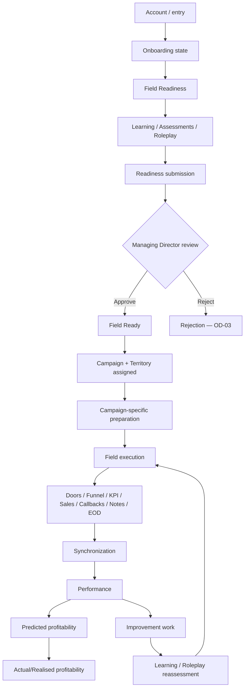
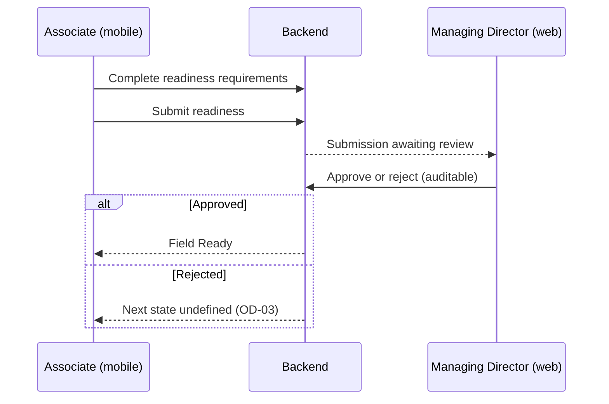
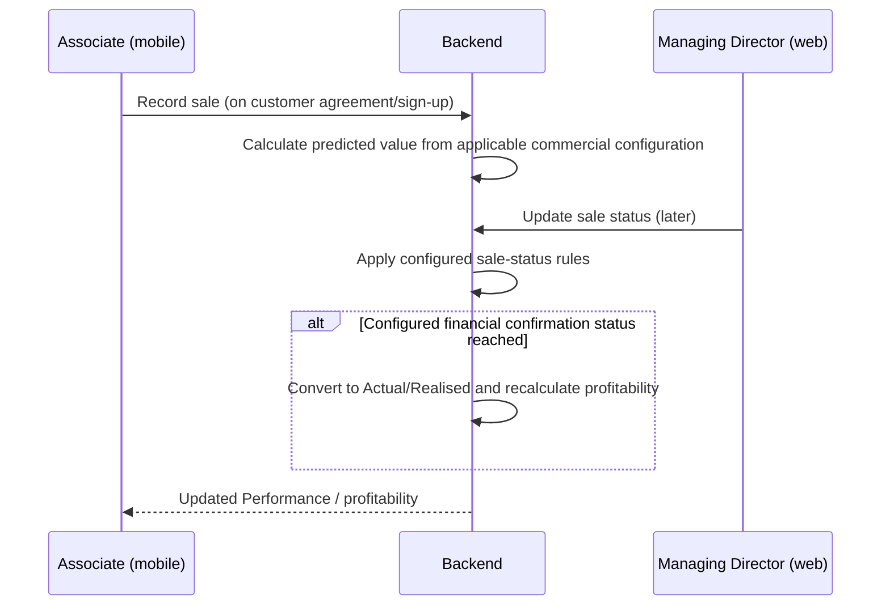
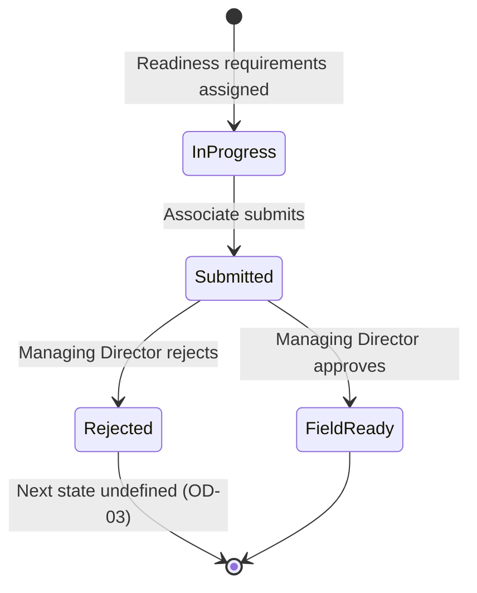
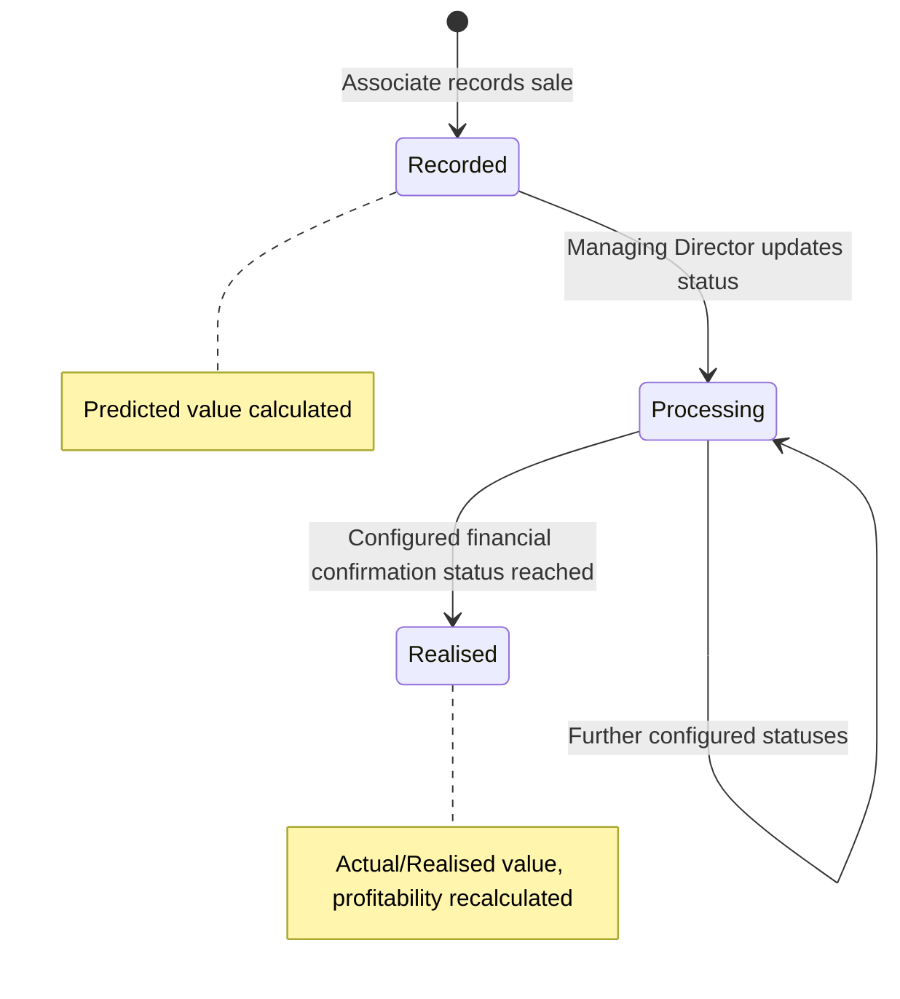
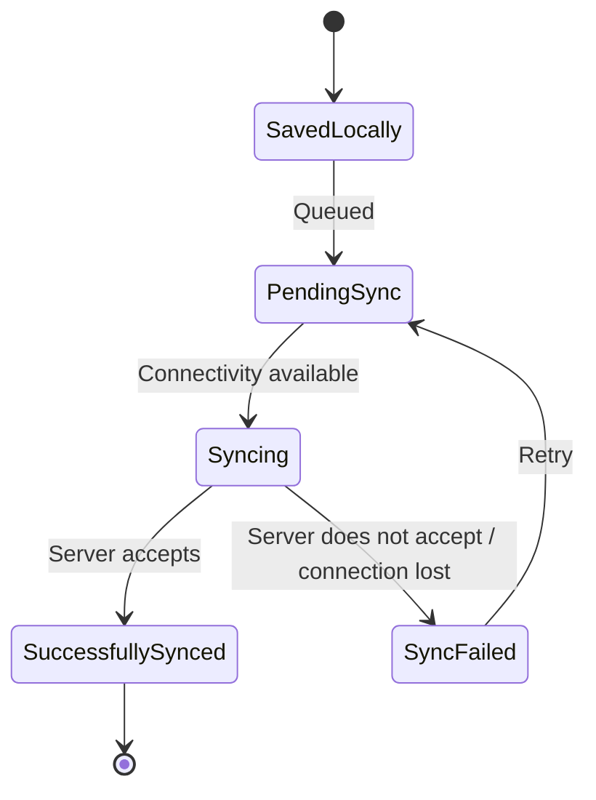
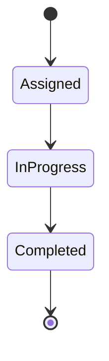
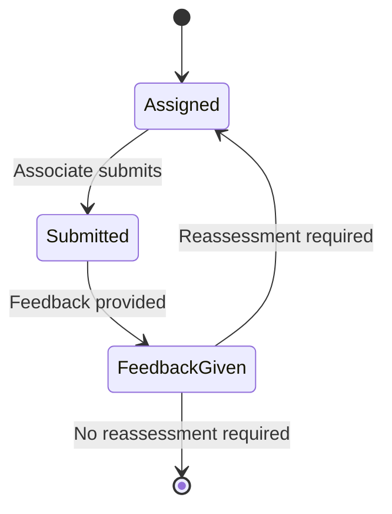
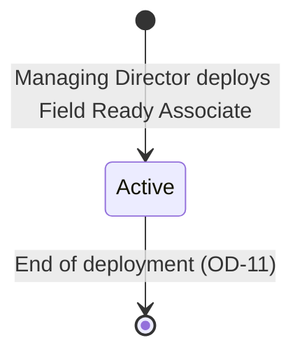

# IMPERIAL OS — V1 User Journeys

> **Related:** [00 — Product Overview](./00-product-overview.md) · [01 — V1 Scope](./01-v1-scope.md)
>
> This document describes how V1 is used by its two primary user experiences: the **Associate** (mobile) and the **Managing Director** (web / Admin). It describes the **functional** journey only. It does not define visual UI or screen design.
>
> It introduces **no new requirements**. Where existing requirements do not define exact behaviour, the gap is marked as an **open decision** (`OD-xx`). All open decisions are maintained centrally in [01 — V1 Scope, Section 16](./01-v1-scope.md#16-open-business-decisions).

---

## Contents

1. [Conventions](#1-conventions)
2. [Associate Journey](#2-associate-journey)
3. [Managing Director Journey](#3-managing-director-journey)
4. [Cross-User Interactions](#4-cross-user-interactions)
5. [State Transitions](#5-state-transitions)
6. [Offline Journey](#6-offline-journey)
7. [Open Decisions Register](#7-open-decisions-register)
8. [Error / Exception Journeys](#8-error--exception-journeys)
9. [Completion Scenario](#9-completion-scenario)

---

## 1. Conventions

### Users

| User              | Experience        | V1 roles covered                 |
| ----------------- | ----------------- | -------------------------------- |
| Associate         | Mobile (primary)  | Junior Associate, Associate      |
| Managing Director | Web / Admin       | Managing Director                |

"Associate" in this document covers both Junior Associate and Associate. Their differences come from status, curriculum, expectations, targets, commercial configuration and progression, not from different journeys or unnecessarily different permissions.

"Admin" is the management/configuration experience, not a role.

### Stage Format

Every journey stage is described with the same five headings:

| Heading                    | Meaning                                                    |
| -------------------------- | ---------------------------------------------------------- |
| **Sees**                   | Information made available to the user (functional, not visual). |
| **Can do**                 | Actions available to the user.                             |
| **Data created / changed** | Records the action creates or updates.                     |
| **System state changes**   | Statuses or derived values that change as a result.        |
| **Next**                   | Where the journey goes from here.                          |

### Domain Ownership

Journeys respect the domain ownership defined in the Product Overview:

| Domain         | Owns                                   |
| -------------- | -------------------------------------- |
| Identity       | Identity                               |
| Learn          | Learning records                       |
| Field          | Field activity                         |
| Performance    | KPI/performance calculations           |
| Business Rules | Organisational logic                   |
| Admin          | Configuration of the platform (does not replace ownership of operational domains) |

---

## 2. Associate Journey

The Associate journey runs from entering IMPERIAL OS through repeating the Core Operating Loop. It happens primarily in the mobile application.

### A1. Account / Entry

| | |
| --- | --- |
| **Sees** | A way to authenticate into IMPERIAL OS. After authentication, their identity/profile. |
| **Can do** | Authenticate. View their identity/profile. |
| **Data created / changed** | None created by the Associate. The account already exists before entry (recruitment, interview and client authorisation happen outside IMPERIAL OS). |
| **System state changes** | Associate has an authenticated session. |
| **Next** | Onboarding state (A2). |

Open decisions: how the account is created and how first access is issued (`OD-04`).

### A2. Onboarding State

| | |
| --- | --- |
| **Sees** | Their onboarding state. Home / daily priorities showing what they need to do next (Direction principle). |
| **Can do** | View onboarding state. Proceed to the items surfaced on Home. |
| **Data created / changed** | Onboarding progress, as items are completed. |
| **System state changes** | Onboarding state advances as items are completed. |
| **Next** | Field Readiness (A3). |

Open decisions: what onboarding consists of (induction, documentation) and how it relates to Field Readiness (`OD-05`); what Home / daily priorities contains (`OD-25`).

### A3. Field Readiness

| | |
| --- | --- |
| **Sees** | The Field Readiness requirements configured by the Managing Director. Their readiness status and progress against each requirement. |
| **Can do** | Open and work on readiness requirements (learning, assessments, roleplay). |
| **Data created / changed** | Progress records against readiness requirements (owned by Learn where learning-related). |
| **System state changes** | Readiness progress updates as requirements are completed. |
| **Next** | Learning (A4), Assessments (A5), Roleplay (A6), then Readiness submission (A7). |

Open decisions: which requirement types make up readiness and what counts as completing each (`OD-06`).

### A4. Learning

| | |
| --- | --- |
| **Sees** | Assigned curricula, modules and lessons, including written/video learning content. Readiness-related learning. Their learning progress. |
| **Can do** | Consume lessons. Progress through modules and curricula. |
| **Data created / changed** | Learning progress records (Learn). |
| **System state changes** | Learning progress for the assignment advances. |
| **Next** | Assessments (A5) / Roleplay (A6), or the next assigned learning. |

Open decisions: learning progress states and completion criteria (`OD-09`).

### A5. Assessments

| | |
| --- | --- |
| **Sees** | Assigned quizzes and assessments. Their results and feedback. |
| **Can do** | Take quizzes. Complete and submit assessments. |
| **Data created / changed** | Assessment/quiz attempt and result records (Learn). |
| **System state changes** | Assessment state moves to submitted; then to a result/feedback state. Reassessment may be required. |
| **Next** | Roleplay (A6), further learning, or reassessment where required. |

Open decisions: scoring, pass criteria and retake rules (`OD-07`).

### A6. Roleplay

| | |
| --- | --- |
| **Sees** | Assigned roleplays. Feedback on submitted roleplays. |
| **Can do** | Complete and submit roleplays. |
| **Data created / changed** | Roleplay submission and feedback records (Learn). |
| **System state changes** | Roleplay state moves to submitted, then to feedback received. Reassessment may be required. |
| **Next** | Further learning, reassessment where required, or Readiness submission (A7). |

Open decisions: roleplay format, how it is submitted and who provides feedback (`OD-08`).

### A7. Readiness Submission

| | |
| --- | --- |
| **Sees** | Their completed readiness requirements and readiness status. |
| **Can do** | Submit readiness for approval. |
| **Data created / changed** | A readiness submission. |
| **System state changes** | Readiness state becomes submitted for approval. |
| **Next** | Managing Director approval (A8). |

Open decisions: whether submission is blocked until all requirements are complete, or guided first (Guide Before Enforce) (`OD-06`).

### A8. Managing Director Approval

| | |
| --- | --- |
| **Sees** | That their readiness is awaiting review, then the outcome (approved or rejected). |
| **Can do** | Nothing required while awaiting review. |
| **Data created / changed** | The Managing Director's decision is recorded and is auditable. |
| **System state changes** | Approved → Field Ready. Rejected → see `OD-03`. |
| **Next** | Approved: Field Ready state (A9). Rejected: undefined (`OD-03`). |

Open decisions: the full rejection flow (`OD-03`); how the Associate is informed of the outcome (`OD-18`).

### A9. Field Ready State

| | |
| --- | --- |
| **Sees** | That they are Field Ready. |
| **Can do** | Receive deployment (Campaign and Territory). |
| **Data created / changed** | None by the Associate. |
| **System state changes** | Associate is Field Ready and eligible for deployment. |
| **Next** | Campaign assignment (A10) and Territory assignment (A11). |

### A10. Campaign Assignment

| | |
| --- | --- |
| **Sees** | Their active Campaign. |
| **Can do** | View active Campaign information. |
| **Data created / changed** | None by the Associate. The assignment is created by the Managing Director as part of a Deployment. |
| **System state changes** | Associate has an active Campaign. Campaign-specific commercial configuration, KPI definitions, targets and learning now apply. |
| **Next** | Territory assignment (A11). |

Open decisions: how Deployment relates to Campaign and Territory, and whether more than one can be active (`OD-11`).

### A11. Territory Assignment

| | |
| --- | --- |
| **Sees** | Their active Territory. |
| **Can do** | View active Territory information. |
| **Data created / changed** | None by the Associate. The assignment is created by the Managing Director as part of a Deployment. |
| **System state changes** | Associate has an active Territory. |
| **Next** | Campaign-specific preparation (A12). |

Interactive mapping and territory intelligence are outside V1.

### A12. Campaign-Specific Preparation

| | |
| --- | --- |
| **Sees** | Campaign-specific learning/preparation, where required. |
| **Can do** | Complete campaign-specific learning, assessments or roleplay. |
| **Data created / changed** | Learning progress and assessment/roleplay records (Learn). |
| **System state changes** | Preparation progress advances to complete. |
| **Next** | Field execution (A13). |

Open decisions: whether Field execution is blocked until required preparation is complete, or guided first (`OD-10`).

### A13. Field Execution

| | |
| --- | --- |
| **Sees** | Recently loaded deployment information: Campaign and Territory. Synchronization status. |
| **Can do** | Begin recording Field activity (A14–A20). Works online or offline (A21). |
| **Data created / changed** | Field activity records (Field is the source of truth). |
| **System state changes** | Associate is in Field execution. |
| **Next** | Door activity (A14) and the other recording stages. |

### A14. Door Activity

| | |
| --- | --- |
| **Sees** | Their recorded doors and outcomes for the current Field work. |
| **Can do** | Record doors. Record door outcomes. |
| **Data created / changed** | Door and door-outcome records (Field). Stored locally first; each record carries a synchronization state. |
| **System state changes** | Record enters the synchronization lifecycle (Section 5.3). |
| **Next** | Funnel activity (A15), Sale (A17), Callback (A18), or next door. |

Open decisions: the set of door outcomes and whether it is configurable (`OD-12`); editing records after entry (`OD-21`).

### A15. Funnel Activity

| | |
| --- | --- |
| **Sees** | Their funnel activity across the five standard stages. |
| **Can do** | Record funnel activity against the standard stages: Attention & Engagement → Problem Awareness → Consequence Evaluation → Solution Alignment → Close / Agreement. |
| **Data created / changed** | Funnel activity records (Field). |
| **System state changes** | Funnel data must remain logically valid: a later-stage count cannot exceed an earlier-stage count. |
| **Next** | KPI recording (A16), Sale (A17). |

Open decisions: recording granularity (per door vs aggregate counts) and where funnel validity is enforced (`OD-13`).

### A16. KPI Recording

| | |
| --- | --- |
| **Sees** | The KPI inputs defined for their Campaign. |
| **Can do** | Record KPI inputs. |
| **Data created / changed** | KPI input records (Field). Performance later consumes these; it does not duplicate the input. |
| **System state changes** | Record enters the synchronization lifecycle. |
| **Next** | Continue Field work; data becomes available to Performance once synced (A23). |

### A17. Sale Recording

| | |
| --- | --- |
| **Sees** | Their recorded sales. |
| **Can do** | Record a sale when the customer gives agreement/sign-up. |
| **Data created / changed** | A sale record (Field). |
| **System state changes** | Once accepted by the server, the system calculates **predicted financial value** from the applicable commercial configuration. The sale enters its initial configured sale status. |
| **Next** | Continue Field work. The Managing Director later updates sale status (Section 4.2). |

IMPERIAL OS does not recreate client CRM/sales systems. Open decisions: required sale fields (`OD-14`).

### A18. Callback Recording

| | |
| --- | --- |
| **Sees** | Their recorded callbacks. |
| **Can do** | Record callbacks. |
| **Data created / changed** | Callback records (Field). |
| **System state changes** | Record enters the synchronization lifecycle. |
| **Next** | Continue Field work. |

Open decisions: callback triggering, due-date, escalation and overdue behaviour (`OD-01`).

### A19. Notes

| | |
| --- | --- |
| **Sees** | Notes they have recorded. |
| **Can do** | Record notes where required. Supported offline. |
| **Data created / changed** | Note records (Field). |
| **System state changes** | Record enters the synchronization lifecycle. |
| **Next** | Continue Field work. |

### A20. EOD Reporting

| | |
| --- | --- |
| **Sees** | Their draft EOD report. |
| **Can do** | Create a draft EOD report, including offline where practical. |
| **Data created / changed** | Draft EOD record (Field). |
| **System state changes** | Draft is stored locally and queued. **Final server-side processing happens only after synchronization.** |
| **Next** | Synchronization (A22). |

Open decisions: EOD deadline behaviour (`OD-02`); EOD content and what final processing does (`OD-22`).

### A21. Offline Operation

| | |
| --- | --- |
| **Sees** | Recently loaded Campaign/Territory/deployment information. The synchronization state of each record. |
| **Can do** | Continue recording doors, outcomes, funnel/KPI inputs, sales, callbacks, notes and draft EOD without connectivity. |
| **Data created / changed** | Records stored safely on-device and queued. |
| **System state changes** | Records are **Saved locally** / **Pending sync**. Nothing is shown as submitted. |
| **Next** | Synchronization on reconnect (A22). See [Section 6](#6-offline-journey). |

### A22. Synchronization

| | |
| --- | --- |
| **Sees** | Explicit synchronization state: Saved locally, Pending sync, Syncing, Successfully synced, Sync failed. |
| **Can do** | Observe sync state. Retry is required for failed sync. |
| **Data created / changed** | Records are delivered to the server. Duplicate submissions are protected against. |
| **System state changes** | Records move to **Successfully synced** only after server acceptance, or to **Sync failed**. |
| **Next** | Synced data becomes available to Performance (A23). |

Open decisions: retry policy and per-record server rejection handling (`OD-19`).

### A23. Performance

| | |
| --- | --- |
| **Sees** | KPI records, funnel performance, performance history, relevant targets and performance analysis. |
| **Can do** | Review how they are performing and where they can improve. |
| **Data created / changed** | None by the Associate. Performance calculates KPIs from synced Field data. |
| **System state changes** | KPI/performance calculations update (Performance). |
| **Next** | Predicted profitability (A24); Improvement work (A26). |

### A24. Predicted Profitability

| | |
| --- | --- |
| **Sees** | Predicted financial value and predicted profitability. |
| **Can do** | Review. |
| **Data created / changed** | None by the Associate. Calculated from commercial configuration (sale values, day rates) applicable at the time. |
| **System state changes** | Predicted profitability recalculates as sales and commercial data change. |
| **Next** | Actual/Realised profitability once the configured status is reached (A25). |

Open decisions: the profitability formula and period (`OD-16`).

### A25. Actual/Realised Profitability

| | |
| --- | --- |
| **Sees** | Actual/realised financial value and actual/realised profitability. |
| **Can do** | Review. |
| **Data created / changed** | None by the Associate. Triggered when the Managing Director updates a sale to the configured financial confirmation status. |
| **System state changes** | Sale financial value converts from Predicted to Actual/Realised; profitability is recalculated. Historical calculations preserve the commercial configuration that applied at the relevant time. |
| **Next** | Improvement work (A26). |

### A26. Improvement Work

| | |
| --- | --- |
| **Sees** | Improvement actions assigned or surfaced to them. |
| **Can do** | Open and complete improvement work (learning, roleplay). |
| **Data created / changed** | Learning/roleplay assignments and progress (Learn). |
| **System state changes** | Improvement work becomes assigned/in progress. |
| **Next** | Learning / Roleplay reassessment (A27). |

Open decisions: how improvement is identified and assigned (`OD-17`).

### A27. Learning / Roleplay Reassessment

| | |
| --- | --- |
| **Sees** | Assigned learning, roleplay or reassessment, and feedback. |
| **Can do** | Complete work. Submit roleplay/assessment. Receive feedback. Reassess where required. |
| **Data created / changed** | Learning progress, submission and feedback records (Learn). |
| **System state changes** | Follows the V1 learning loop: assigned → work completed → submitted → feedback → improvement → reassessment where required. |
| **Next** | Return to the operating loop (A28). |

### A28. Return to the Operating Loop

| | |
| --- | --- |
| **Sees** | Home / daily priorities, active deployment, current performance. |
| **Can do** | Apply the improvement in Field execution. |
| **Data created / changed** | New Field activity records. |
| **System state changes** | Loop repeats from Field execution (A13). |
| **Next** | Field execution (A13). |

---

## 3. Managing Director Journey

The Managing Director journey happens in the web / Admin application. The Managing Director has company-wide authorised visibility and management capabilities. Configuration in this journey requires connectivity.

### M1. Authentication

| | |
| --- | --- |
| **Sees** | A way to authenticate into the web / Admin application. |
| **Can do** | Authenticate. |
| **Data created / changed** | None. |
| **System state changes** | Authenticated session with Managing Director role and organisation-level scope. |
| **Next** | Organisation overview (M2). |

Open decisions: authentication method (`OD-04`).

### M2. Organisation Overview

| | |
| --- | --- |
| **Sees** | Relevant operational/performance information for the organisation. |
| **Can do** | Navigate to management and configuration areas. |
| **Data created / changed** | None. |
| **System state changes** | None. |
| **Next** | Any management area (M3–M23). |

Open decisions: overview contents (`OD-25`). Advanced dashboards and dashboard builders are outside V1.

### M3. User Management

| | |
| --- | --- |
| **Sees** | Users in the organisation. |
| **Can do** | Manage users and their organisational assignments. |
| **Data created / changed** | User and organisational assignment records (Identity). One identity per user; no separate identities per role. |
| **System state changes** | User access and assignments change. |
| **Next** | Associate management (M4). |

Open decisions: account creation and credential issue (`OD-04`).

### M4. Associate Management

| | |
| --- | --- |
| **Sees** | Associates, their role (Junior Associate / Associate), status, readiness state and deployment. |
| **Can do** | Manage Associate organisational assignments. |
| **Data created / changed** | Associate assignment records. |
| **System state changes** | Associate status/assignment changes. |
| **Next** | Learning configuration (M5) or Readiness approval (M10). |

Open decisions: how a Junior Associate progresses to Associate (`OD-26`).

### M5. Learning Configuration

| | |
| --- | --- |
| **Sees** | Learning content. |
| **Can do** | Create and manage written/video learning content, modules, lessons and learning assignments. |
| **Data created / changed** | Learning content and assignment records (Learn, configured via Admin). |
| **System state changes** | New/changed content becomes available to assigned Associates. |
| **Next** | Curriculum configuration (M6). |

AI-generated learning is outside V1.

### M6. Curriculum Configuration

| | |
| --- | --- |
| **Sees** | Curricula. |
| **Can do** | Create and manage curricula, including readiness-related and campaign-specific curricula. |
| **Data created / changed** | Curriculum records (Learn). |
| **System state changes** | Associates' assigned curricula change. |
| **Next** | Assessment configuration (M7). |

### M7. Assessment Configuration

| | |
| --- | --- |
| **Sees** | Quizzes and assessments. |
| **Can do** | Create and manage quizzes and assessments. |
| **Data created / changed** | Assessment definitions (Learn). |
| **System state changes** | Assessments become available for assignment. |
| **Next** | Roleplay configuration (M8). |

Open decisions: scoring and pass criteria (`OD-07`).

### M8. Roleplay Configuration

| | |
| --- | --- |
| **Sees** | Roleplays. |
| **Can do** | Create and manage roleplays. |
| **Data created / changed** | Roleplay definitions (Learn). |
| **System state changes** | Roleplays become available for assignment. |
| **Next** | Field Readiness configuration (M9). |

Open decisions: roleplay format and feedback provider (`OD-08`).

### M9. Field Readiness Configuration

| | |
| --- | --- |
| **Sees** | Field Readiness requirements. |
| **Can do** | Manage Field Readiness requirements. |
| **Data created / changed** | Readiness requirement configuration (Business Rules). |
| **System state changes** | The requirements Associates must meet change. |
| **Next** | Readiness approval (M10). |

Open decisions: requirement types (`OD-06`); impact of changes on Associates already in progress (`OD-28`).

### M10. Readiness Approval

| | |
| --- | --- |
| **Sees** | Readiness submissions awaiting review, with the Associate's readiness progress. |
| **Can do** | Review. Approve or reject. The Managing Director is the only V1 approver; there is no delegation. |
| **Data created / changed** | An auditable approval/rejection decision. |
| **System state changes** | Approve → Associate becomes Field Ready. Reject → `OD-03`. |
| **Next** | Deployment management (M13) for approved Associates. |

### M11. Campaign Management

| | |
| --- | --- |
| **Sees** | Campaigns. |
| **Can do** | Create and manage Campaigns, including campaign-specific differences. |
| **Data created / changed** | Campaign records. |
| **System state changes** | Campaigns become available for deployment. |
| **Next** | Territory management (M12). |

### M12. Territory Management

| | |
| --- | --- |
| **Sees** | Territories. |
| **Can do** | Create and manage Territories. |
| **Data created / changed** | Territory records. |
| **System state changes** | Territories become available for deployment. |
| **Next** | Deployment management (M13). |

Interactive mapping, territory intelligence and route optimization are outside V1.

### M13. Deployment Management

| | |
| --- | --- |
| **Sees** | Deployments and Field Ready Associates. |
| **Can do** | Create and manage Deployments assigning Field Ready Associates to Campaign and Territory. |
| **Data created / changed** | Deployment records. |
| **System state changes** | Associate gains an active Campaign and Territory. |
| **Next** | Associate proceeds to campaign-specific preparation (A12). |

Open decisions: deployment states and multiplicity (`OD-11`).

### M14. Commercial Configuration

| | |
| --- | --- |
| **Sees** | Commercial configuration per campaign/client. |
| **Can do** | Manage campaign/client sale value, expected processing/payment timeframe and campaign-specific differences. |
| **Data created / changed** | Commercial configuration records. |
| **System state changes** | Predicted value for new sales uses the applicable configuration. Historical calculations preserve the configuration that applied at the time. |
| **Next** | Sale status management (M15). |

Open decisions: how the expected processing/payment timeframe is used (`OD-16`).

### M15. Sale Status Management

| | |
| --- | --- |
| **Sees** | Configured sale statuses (including which status is the actual/realised status) and recorded sales with their current status. |
| **Can do** | Configure sale statuses. Update the status of individual sales. |
| **Data created / changed** | Sale status configuration; sale status changes. The Managing Director does **not** type profit. |
| **System state changes** | When a sale reaches the configured financial confirmation status, its value converts to Actual/Realised and profitability is recalculated. |
| **Next** | Profitability visibility (M21). |

Open decisions: allowed transitions and reversals (`OD-15`); whether status changes are audited (`OD-24`).

### M16. Day-Rate Configuration

| | |
| --- | --- |
| **Sees** | Associate day rates and their effective dates. |
| **Can do** | Set and change day rates with effective dates. |
| **Data created / changed** | Effective-dated day-rate records. |
| **System state changes** | Profitability for periods after the effective date uses the new rate; earlier periods keep the rate that applied. |
| **Next** | KPI configuration (M17). |

### M17. KPI Configuration

| | |
| --- | --- |
| **Sees** | KPI definitions. |
| **Can do** | Manage KPI definitions, including campaign-specific definitions around the standard funnel structure. |
| **Data created / changed** | KPI definition records. |
| **System state changes** | KPI inputs and Performance calculations follow the definitions. The five funnel stages themselves are standardized. |
| **Next** | Targets and thresholds (M18). |

### M18. Targets and Thresholds

| | |
| --- | --- |
| **Sees** | Targets and thresholds. |
| **Can do** | Manage KPI targets, KPI thresholds and operating thresholds. |
| **Data created / changed** | Target and threshold records (Business Rules). |
| **System state changes** | Performance analysis compares against the configured targets/thresholds. |
| **Next** | Business rules (M19). |

### M19. Business Rules

| | |
| --- | --- |
| **Sees** | Required V1 business rules. |
| **Can do** | Configure readiness requirements, callbacks, EOD deadlines, approvals, operating thresholds, commercial rules and sale-status rules. |
| **Data created / changed** | Business rule configuration (Business Rules, held in the backend). |
| **System state changes** | System behaviour follows the configured rules. |
| **Next** | Performance visibility (M20). |

No generic workflow/configuration engine unless V1 requires it. Open decisions: callback (`OD-01`) and EOD (`OD-02`) behaviour.

### M20. Performance Visibility

| | |
| --- | --- |
| **Sees** | Associates' KPI records, funnel performance, performance history and performance against targets. |
| **Can do** | Review performance. |
| **Data created / changed** | None. |
| **System state changes** | None. |
| **Next** | Improvement assignment (via Learning configuration) or Profitability visibility (M21). |

Advanced analytics and predictive BI are outside V1.

### M21. Profitability Visibility

| | |
| --- | --- |
| **Sees** | Predicted and actual/realised financial value and profitability. |
| **Can do** | Review. |
| **Data created / changed** | None. |
| **System state changes** | None. |
| **Next** | Sale status management (M15) as sales progress. |

### M22. Operational Monitoring

| | |
| --- | --- |
| **Sees** | Relevant operational information (e.g. readiness submissions awaiting review, deployments, Field activity). |
| **Can do** | Act on items through the relevant management areas. |
| **Data created / changed** | None directly. |
| **System state changes** | None directly. |
| **Next** | The relevant management area. |

Open decisions: monitoring contents (`OD-25`); escalations/notifications (`OD-18`).

### M23. Audit / Approval History

| | |
| --- | --- |
| **Sees** | Approval history where required. |
| **Can do** | Review approval decisions. |
| **Data created / changed** | None. Approval records are written at decision time. |
| **System state changes** | None. |
| **Next** | Return to management areas. |

Approvals must be auditable. Open decisions: audit scope beyond approvals and how history is presented (`OD-24`).

---

## 4. Cross-User Interactions

### 4.1 Field Readiness Approval

### 4.2 Sale Status and Financial State

### 4.3 Configuration Consumed in Operation

| Managing Director configures | Associate consumes it as                                              |
| ---------------------------- | --------------------------------------------------------------------- |
| Campaign                     | Active Campaign and campaign-specific preparation                    |
| Territory                    | Active Territory                                                      |
| Deployment                   | Assignment to Campaign + Territory                                   |
| Commercial configuration     | Predicted and actual/realised value and profitability                 |
| Day rates                    | Profitability (effective-dated)                                       |
| Learning, curricula, assessments, roleplays | Assigned learning, readiness requirements and improvement work |
| Field Readiness requirements | Readiness checklist and status                                        |
| KPI definitions              | KPI inputs recorded in Field                                          |
| Targets / thresholds         | Performance analysis                                                  |
| Business rules               | Readiness, callbacks, EOD deadlines, approvals and sale-status behaviour |

### 4.4 Improvement Work

Performance data is visible to both users. Improvement work is "assigned or surfaced" to the Associate. Whether the Managing Director assigns it, the system surfaces it from thresholds, or both, is undefined (`OD-17`).

---

## 5. State Transitions

State names below are descriptive. Only the five synchronization states are fixed names defined by the requirements.

### 5.1 Associate Readiness State

| Transition                 | Actor             | Notes                                     |
| -------------------------- | ----------------- | ----------------------------------------- |
| In progress → Submitted    | Associate         | Submission preconditions: `OD-06`         |
| Submitted → Field Ready    | Managing Director | Auditable                                 |
| Submitted → Rejected       | Managing Director | Auditable; next state `OD-03`             |

Whether an Associate can leave Field Ready (e.g. on configuration change) is undefined (`OD-28`).

### 5.2 Sale Status

The intermediate statuses are **configured by the Managing Director**; "Processing" stands for any number of them. Allowed transitions, reversals and non-realised end states are undefined (`OD-15`).

### 5.3 Synchronization State

| State               | Meaning                                                    |
| ------------------- | ---------------------------------------------------------- |
| Saved locally       | Stored safely on-device. **Not** submitted.                |
| Pending sync        | Queued for synchronization. **Not** submitted.             |
| Syncing             | Delivery in progress. **Not** yet accepted.                |
| Successfully synced | Server has accepted the record. Only now is it submitted.  |
| Sync failed         | Not accepted. Must be retried.                             |

### 5.4 Learning Progress

Exact progress states and completion criteria are undefined (`OD-09`).

### 5.5 Roleplay / Assessment State

Follows the V1 learning loop. Scoring, pass criteria and the feedback provider are undefined (`OD-07`, `OD-08`).

### 5.6 Deployment State

The requirements define an "active" Campaign and Territory only. Other deployment states, start/end behaviour and multiplicity are undefined (`OD-11`).

---

## 6. Offline Journey

Offline support covers business-critical Field execution only. Admin configuration, curriculum creation, commercial and business rules configuration, company dashboards, advanced analytics and advanced mapping may require connectivity.

| # | Step                         | What happens                                                                                                                      |
| - | ---------------------------- | --------------------------------------------------------------------------------------------------------------------------------- |
| 1 | Starts Field work online     | Deployment information (Campaign, Territory) is loaded onto the device.                                                           |
| 2 | Loses connectivity           | Field execution continues. Recently loaded Campaign/Territory/deployment information remains viewable.                            |
| 3 | Continues Field execution    | Associate can record doors, outcomes, funnel/KPI inputs, sales, callbacks, notes and draft EOD.                                   |
| 4 | Records data locally         | Each record is stored safely on-device and shown as **Saved locally**, then **Pending sync**.                                    |
| 5 | Reconnects                   | Queued records begin delivery and show **Syncing**.                                                                               |
| 6 | Synchronizes                 | The server receives records. Duplicate submissions are protected against, so a record sent more than once is accepted only once. |
| 7 | Receives success or failure  | **Successfully synced** only after server acceptance; otherwise **Sync failed**, and failed sync is retried.                     |

> **Local storage is not server acceptance.** A record that is Saved locally, Pending sync or Syncing has **not** been submitted. The application must never claim submission until the server has accepted it.

Consequences while offline:

- Predicted financial value, KPI calculations and Performance depend on server-side data, so they reflect offline records only after sync.
- Draft EOD can be created offline where practical; final EOD processing happens only after sync.

Open decisions: how "recently loaded" is defined and session/authentication expiry while offline (`OD-20`); retry policy (`OD-19`).

---

## 7. Open Decisions Register

This document references open decisions `OD-01`–`OD-28`. The complete central list is `OD-01`–`OD-32`, maintained in [01 — V1 Scope, Section 16: Open Business Decisions](./01-v1-scope.md#16-open-business-decisions), which is the source of truth.

This document does not keep its own copy. Look up any `OD-xx` reference there.

---

## 8. Error / Exception Journeys

| Exception                         | Implied by                                              | Defined behaviour                                                                                             | Undefined   |
| --------------------------------- | ------------------------------------------------------- | ------------------------------------------------------------------------------------------------------------- | ----------- |
| Readiness rejection               | Managing Director approves **or rejects**                | Decision is recorded and auditable. Associate is not Field Ready.                                            | `OD-03`     |
| Failed synchronization            | Sync failed state; retry requirement                     | Record shows **Sync failed**, remains on-device and is retried. It is never shown as submitted.             | `OD-19`     |
| Duplicate synchronization         | Duplicate-submission protection                          | Re-sending the same record (e.g. after a retry or reconnect) must not create a duplicate on the server.     | —           |
| Invalid sale status transition    | Configurable statuses and sale-status rules              | Sale-status rules are a V1 business rule category, so invalid transitions are governed by configured rules. | `OD-15`     |
| Invalid funnel data               | Funnel integrity rule                                    | A later-stage count must not exceed an earlier-stage count.                                                  | `OD-13`     |
| Missing required data             | Recording requirements                                   | Not defined beyond the records that must be capturable.                                                      | `OD-23`     |
| Loss of connectivity              | Offline requirement                                      | Field execution continues offline (Section 6). Non-Field functions may require connectivity.                | `OD-20`     |
| Unauthorized action               | View / Act / Approve permissions; scope                  | The action is not permitted (e.g. only the Managing Director approves readiness or updates sale status).    | `OD-27`     |

---

## 9. Completion Scenario

One complete pass through the V1 operating loop, matching the [V1 Completion Test](./01-v1-scope.md#14-v1-completion-test).

| #  | Step                                   | Who               | What happens                                                                                                            |
| -- | -------------------------------------- | ----------------- | ----------------------------------------------------------------------------------------------------------------------- |
| 1  | Associate enters                       | Associate         | An existing, recruited and client-authorised Associate authenticates into the mobile application and sees their onboarding state and what to do next. |
| 2  | Completes Field Readiness              | Associate         | Completes the configured readiness learning, assessments and roleplays, then submits readiness.                        |
| 3  | Becomes Field Ready                    | Managing Director | Reviews the submission in the web application and approves it. The approval is auditable. The Associate is Field Ready. |
| 4  | Receives Campaign / Territory          | Managing Director | Creates a Deployment assigning the Associate to a Campaign and Territory.                                              |
| 5  | Prepares                               | Associate         | Completes campaign-specific learning/preparation.                                                                       |
| 6  | Works in Field                         | Associate         | Enters Field execution with deployment information loaded on the device.                                               |
| 7  | Records activity                       | Associate         | Records doors, outcomes, funnel activity across the five stages, KPI inputs, callbacks and notes.                      |
| 8  | Works offline if necessary             | Associate         | Loses connectivity and keeps recording. Records show **Saved locally** / **Pending sync**. A draft EOD is created.      |
| 9  | Synchronizes                           | System            | On reconnect, records move through **Syncing** to **Successfully synced** once the server accepts them, with no duplicates. EOD final processing happens. |
| 10 | Sale is recorded                       | Associate / System | A sale recorded on customer sign-up is accepted by the server; predicted financial value is calculated from the applicable commercial configuration. |
| 11 | Managing Director updates status       | Managing Director | Later updates the sale's status through the configured statuses to the financial confirmation status.                 |
| 12 | Profitability changes                  | System            | The sale value converts to Actual/Realised and profitability is recalculated using the commercial configuration (including the day rate) that applied at the time. |
| 13 | Associate sees performance             | Associate         | Sees KPIs, funnel performance, targets, predicted and actual/realised profitability.                                   |
| 14 | Receives improvement work              | Associate         | Learning/roleplay improvement work is assigned or surfaced (`OD-17`).                                                  |
| 15 | Completes learning / roleplay          | Associate         | Completes the work, submits roleplay/assessment, receives feedback, and reassesses where required.                     |
| 16 | Returns to Field                       | Associate         | Returns to Field execution and applies the improvement. The operating loop repeats.                                    |
