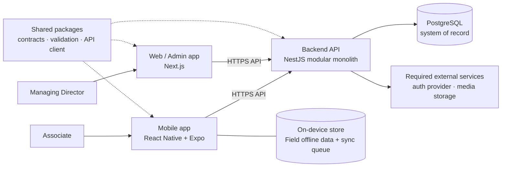
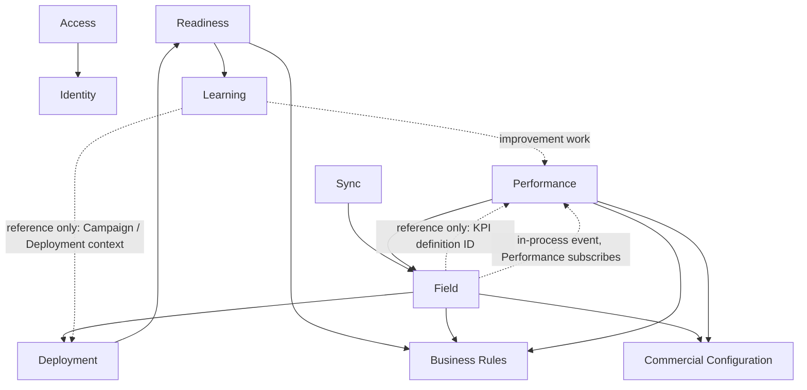
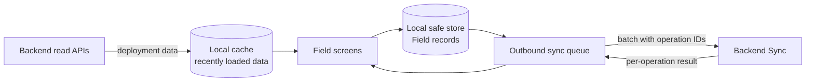
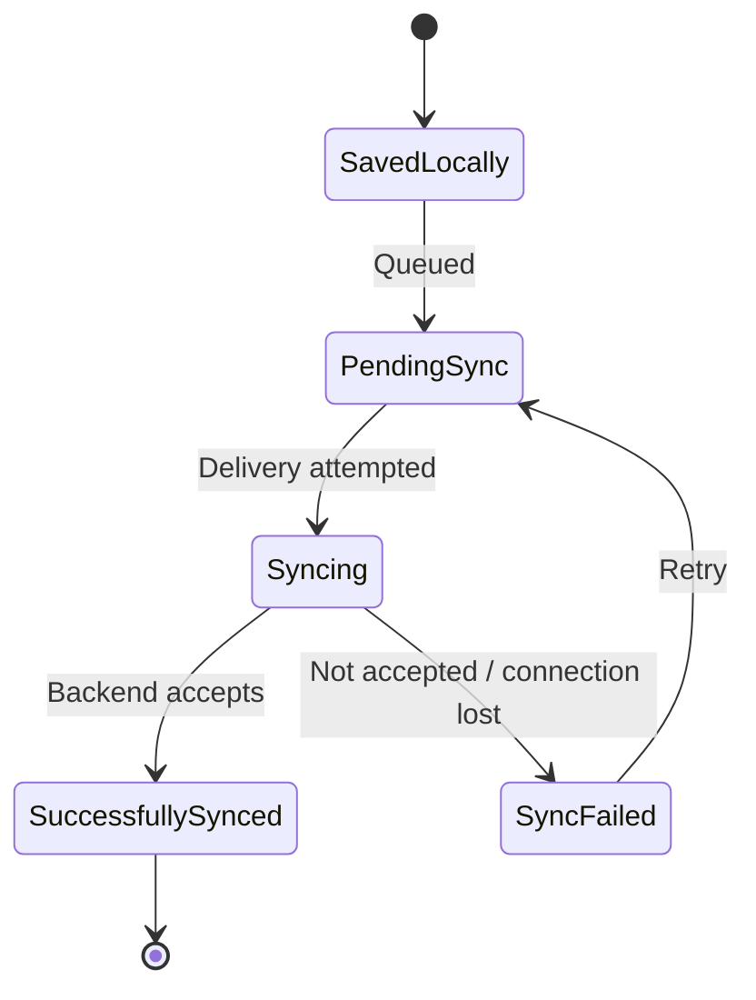
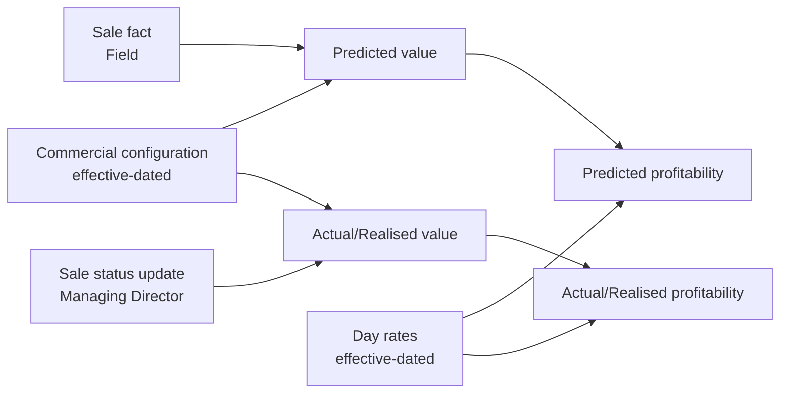
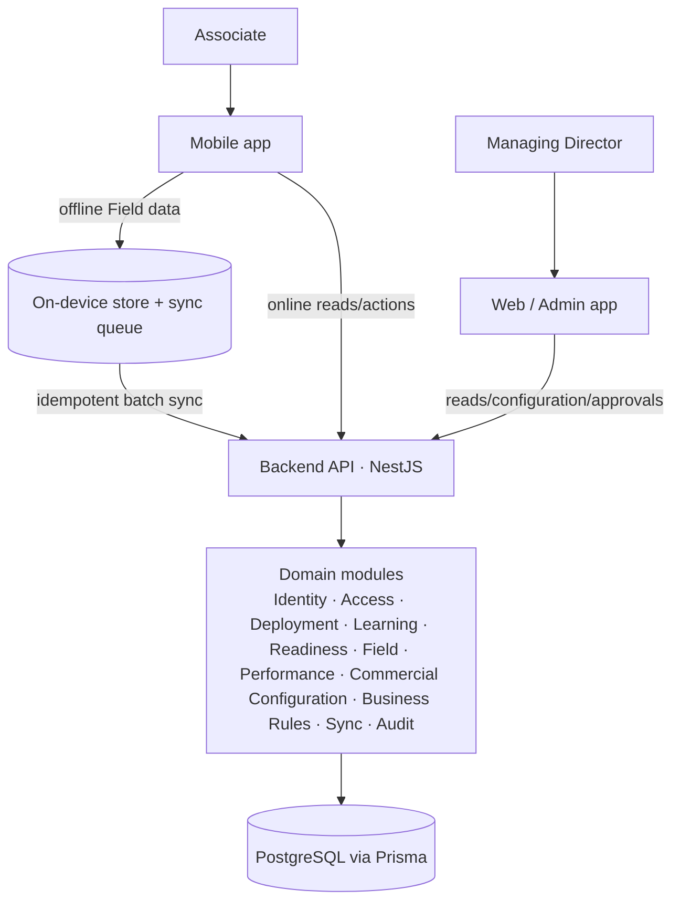

# IMPERIAL OS — V1 Architecture

> **Related:** [00 — Product Overview](./00-product-overview.md) · [01 — V1 Scope](./01-v1-scope.md) · [02 — User Journeys](./02-user-journeys.md)
>
> This document describes the technical architecture for IMPERIAL OS V1. It is an architecture document, not an implementation. It introduces **no business requirements**.
>
> - Product behaviour that is still undecided is referenced by its open decision ID (`OD-xx`) from [01 — V1 Scope, Section 16](./01-v1-scope.md#16-open-business-decisions). This document does not resolve any of them.
> - Technical choices that the product documents do not dictate are labelled **architectural decisions** (`AD-xx`).
> - Technical choices that still need to be made are labelled **architectural open items** (`AQ-xx`). These are engineering questions, not business decisions.

---

## Contents

1. [Architecture Goals](#1-architecture-goals)
2. [System Shape](#2-system-shape)
3. [Technology Stack](#3-technology-stack)
4. [Repository Architecture](#4-repository-architecture)
5. [Backend Module Boundaries](#5-backend-module-boundaries)
6. [Domain Ownership](#6-domain-ownership)
7. [Authentication, Authorization and Access Model](#7-authentication-authorization-and-access-model)
8. [API Boundary](#8-api-boundary)
9. [Database Architecture](#9-database-architecture)
10. [Offline Architecture](#10-offline-architecture)
11. [Data Synchronization Principles](#11-data-synchronization-principles)
12. [Profitability Architecture](#12-profitability-architecture)
13. [Learning and Roleplay Architecture](#13-learning-and-roleplay-architecture)
14. [Configuration Architecture](#14-configuration-architecture)
15. [Auditability](#15-auditability)
16. [Environments and Deployment](#16-environments-and-deployment)
17. [Testing Architecture](#17-testing-architecture)
18. [Architectural Constraints](#18-architectural-constraints)
19. [Architectural Decisions and Open Decisions](#19-architectural-decisions-and-open-decisions)
20. [V1 Architecture Summary](#20-v1-architecture-summary)

---

## 1. Architecture Goals

### What V1 Must Support

The architecture exists to prove the **Core Operating Loops** — Performance, Learning, Roleplay and Deployment / Field execution — through the V1 Associate journey:

Enter IMPERIAL OS → Field Readiness → Managing Director approval → Field Ready → Campaign + Territory → campaign-specific preparation → Field execution → record activity → Performance → predicted and actual/realised profitability → improvement → Learning / Roleplay → repeat.

### Goals

| Goal                                  | What it means for the architecture                                                                                   |
| ------------------------------------- | -------------------------------------------------------------------------------------------------------------------- |
| Reliable operating loop               | Every step of the Associate journey is backed by a clear backend state and a clear owning module.                    |
| Field execution that survives offline | Business-critical Field recording works without connectivity and synchronizes safely.                                |
| One source of business truth          | Business logic, state transitions and calculations live in the backend, not in clients.                              |
| Correct financial history             | Predicted and actual/realised profitability are derived from facts and effective-dated commercial configuration.     |
| Business configurability              | Routine business changes are made through the Admin experience, not by developers.                                   |
| One identity, multiple perspectives   | One identity per user; no separate identities or applications per role.                                              |
| Extensible, not speculative           | Future roles, scopes, locations and campaigns can be added without redesign, but are not built now.                  |

### Extensibility Without Building the Future

The future roles (Senior Associate, Area Sales Manager, Regional Sales Manager) and future scope dimensions (region, area, campaign, territory) must fit into the access model **without** being implemented in V1. The architecture achieves this by keeping Role, Perspective, Scope and Permission as separate concepts (Section 7), not by building management experiences for them.

---

## 2. System Shape

V1 is a **modular monolith**: one backend application, internally divided into domain modules with explicit boundaries, backed by one PostgreSQL database.



| Component           | Responsibility                                                                                                                         |
| ------------------- | -------------------------------------------------------------------------------------------------------------------------------------- |
| Mobile application  | Primary operational experience for Associates. UI, local state, offline Field storage and sync queue.                                  |
| Web / Admin application | Management and business configuration experience used by the Managing Director.                                                     |
| Backend API         | The application's domain and business-logic boundary. Owns authorization, rules, state transitions, calculations and persistence.     |
| PostgreSQL database | Primary system of record. Accessed only by the backend.                                                                                |
| Shared packages     | API contracts, shared types, validation schemas and a typed API client used by clients and backend.                                   |
| External services   | Only those actually required: an authentication provider (`AQ-01`, depends on `OD-04`) and storage for video/written learning media (`AQ-02`). |

**Mobile and web are clients of the backend.** They do not contain duplicated business-critical domain logic, and they do not access the database directly.

---

## 3. Technology Stack

| Layer                       | Technology                    | Source                                                                         |
| --------------------------- | ----------------------------- | ------------------------------------------------------------------------------ |
| Mobile                      | React Native + Expo           | Product Overview                                                               |
| Web                         | Next.js                       | Product Overview                                                               |
| Backend                     | NestJS                        | Product Overview                                                               |
| Language                    | TypeScript (all applications and packages) | Product Overview                                                  |
| Database                    | PostgreSQL, hosted through Supabase | Product Overview (managed PostgreSQL; Supabase for development) — see `AQ-04` for PROD hosting |
| ORM                         | Prisma                        | Product Overview                                                               |
| Monorepo tooling            | pnpm workspaces + Turborepo   | Agreed stack                                                                   |

Supporting choices (architectural decisions, not business requirements):

| ID    | Decision                                                                                                                                                     |
| ----- | ------------------------------------------------------------------------------------------------------------------------------------------------------------ |
| AD-01 | Supabase is used as **managed PostgreSQL hosting only**. Clients do not use Supabase's direct client-to-database data APIs for business operations.          |
| AD-02 | A single schema-validation library (Zod) is used in `packages/` so request/response contracts are defined once and shared by clients and backend.           |
| AD-03 | The mobile app uses an on-device SQLite store (via Expo) for offline Field data and the sync queue, and the platform secure store for credentials/tokens.  |

No other frameworks are introduced. Any further framework requires a requirement-driven reason.

---

## 4. Repository Architecture

The repository is a pnpm + Turborepo monorepo. The structure below is **intended**; it is not created by this document.

```text
imperial-os/
├── apps/
│   ├── mobile/          # React Native + Expo — Associate experience
│   └── web/             # Next.js — Web / Admin experience (Managing Director)
├── backend/
│   └── api/             # NestJS modular monolith + Prisma schema and migrations
├── packages/
│   ├── contracts/       # API request/response types and Zod schemas (shared types + validation)
│   ├── api-client/      # Typed client for the backend API, used by mobile and web
│   └── config/          # Shared TypeScript / lint configuration
├── docs/                # Product, scope, journey and architecture documentation
├── package.json         # Workspace root
├── pnpm-workspace.yaml
└── turbo.json
```

| Location            | Purpose                                                                                                                                          |
| ------------------- | ------------------------------------------------------------------------------------------------------------------------------------------------ |
| `apps/mobile`       | Mobile client. UI, local/offline state, sync queue. No business-critical rules.                                                                 |
| `apps/web`          | Web / Admin client. UI and configuration forms. No business-critical rules.                                                                     |
| `backend/api`       | The single backend application, its domain modules, the Prisma schema and version-controlled migrations.                                        |
| `packages/contracts`| Shared types and validation schemas describing the API. Contains **no** business rules or calculations.                                        |
| `packages/api-client` | Typed API client so clients call the backend consistently.                                                                                     |
| `packages/config`   | Shared tooling configuration.                                                                                                                    |
| `docs/`             | Source of truth for product scope (`01`), open business decisions (`01` §16), journeys (`02`), architecture (`03`) and later design documents such as `06-database.md`. |
| Root configuration  | Workspace definition, Turborepo pipelines, shared scripts. Environment files are not committed (`.env*` is ignored; `.env.example` is allowed).  |

| ID    | Decision                                                                                                                                                       |
| ----- | -------------------------------------------------------------------------------------------------------------------------------------------------------------- |
| AD-04 | The backend lives at `backend/api`, matching the existing top-level `backend/` folder, rather than under `apps/`.                                             |
| AD-05 | Shared packages are limited to `contracts`, `api-client` and `config`. New packages are added only when code is genuinely shared by more than one application. Domain logic is **not** placed in shared packages. |

---

## 5. Backend Module Boundaries

The backend is divided into domain modules. Each module owns its data, exposes behaviour to other modules through its service interface, and does not reach into another module's tables.

### 5.1 Module Map

| Module                       | Covers (from the requested areas)                     | Responsibility                                                                                                     |
| ---------------------------- | ----------------------------------------------------- | ------------------------------------------------------------------------------------------------------------------ |
| **Identity**                 | Identity / Profile                                    | Users, identity, profile, organisational assignments, role assignment, onboarding state (`OD-05`).                 |
| **Access**                   | Permissions / Authorization                           | Perspective, Scope and Permission evaluation (View / Act / Approve). Enforced on every API operation.              |
| **Deployment**               | Campaigns, Territories, Deployments                   | Campaign and Territory records and Deployments assigning Field Ready Associates to them (`OD-11`).                  |
| **Learning**                 | Learning (incl. roleplay and assessments)             | Curricula, modules, lessons, content, quizzes, assessments, roleplays, assignments, progress, submissions, feedback. |
| **Readiness**                | Readiness                                             | Readiness submissions, Managing Director decisions, Associate readiness state.                                     |
| **Field**                    | Field, Sales (recording), Funnel / KPI (inputs)       | Doors, outcomes, funnel activity, KPI inputs, sales and their status, callbacks, notes, EOD drafts/reports.          |
| **Performance**              | Performance, Funnel / KPI (definitions, calculations) | KPI definitions, KPI/performance calculations, funnel performance, predicted and actual/realised profitability.     |
| **Commercial Configuration** | Commercial Configuration                              | Campaign/client sale values, sale status definitions and the Financial Confirmation State, processing/payment timeframe, Associate day rates — all effective-dated. |
| **Business Rules**           | Business Rules                                        | Configured rule values: readiness requirements, targets, thresholds, callback and EOD rules, approval rules, sale-status rules, commercial rules. |
| **Sync**                     | Offline Sync                                          | Receiving client operations, idempotency, per-operation acceptance/failure results. Hands accepted operations to the owning module. |
| **Audit**                    | Auditability (cross-cutting)                          | Append-only record of auditable events (Section 15).                                                               |

### 5.2 Consolidation Decisions

| ID    | Decision                                                                                                                                                                                                                                         |
| ----- | ------------------------------------------------------------------------------------------------------------------------------------------------------------------------------------------------------------------------------------------------ |
| AD-06 | **Campaigns, Territories and Deployments are one Deployment module.** They are tightly linked in V1 and a Deployment cannot exist without both. Splitting them would create cross-module chatter without separating real ownership.          |
| AD-07 | **Sales recording is part of Field.** The user journeys record the sale as a Field record. Field owns the sale fact and its status history. Commercial Configuration owns which statuses exist; Business Rules owns which transitions are allowed (`OD-15`); Performance owns the resulting values. |
| AD-08 | **Funnel / KPI is split by ownership, not made a module.** Funnel and KPI *inputs* are Field activity. KPI *definitions* and all KPI/funnel *calculations* belong to Performance. Targets and thresholds belong to Business Rules.             |
| AD-09 | **Roleplay and assessments are part of Learning.** They share the V1 learning loop (assigned → completed → submitted → feedback → reassessment).                                                                                             |
| AD-10 | **Readiness is separate from Learning.** Learning owns learning records; Readiness owns the submission, approval decision and readiness state. Readiness reads Learning progress; it does not copy it.                                       |
| AD-11 | **Admin is not a data-owning module.** Admin is the web experience. Configuration endpoints live in the module that owns the data, protected by Access. There is no `Admin` module that stores its own copy of domain data.                  |
| AD-12 | **Business Rules is not a generic workflow engine.** It stores typed, V1-specific rule values. The owning domain module reads them and applies them.                                                                                         |
| AD-13 | **Sync owns delivery, not data.** Sync records which client operations were received and their outcome. The resulting business records are owned by Field (or the relevant module).                                                         |
| AD-14 | No Notifications module is built until the behaviour is decided (`OD-18`).                                                                                                                                                                    |

### 5.3 Module Dependencies



Solid arrows mean "reads from / calls". Dotted "reference only" arrows mean the module holds the owner's identifier but does not call the owning module (`AD-23`). The dotted "in-process event" arrow means Field emits an event after committing, and Performance subscribes to it; Field does not call Performance (`AD-25`). Every module uses Access for authorization and may write to Audit. Dependencies must not become circular; where a reverse flow is needed (e.g. improvement work from Performance, `OD-17`), it is decided when `OD-17` is resolved.

| Relationship                                   | Kind            | Purpose                                                                                                       |
| ---------------------------------------------- | --------------- | ------------------------------------------------------------------------------------------------------------- |
| Field → Commercial Configuration               | Reads           | Field reads the commercial configuration it needs for field/sale operations, e.g. the configured sale statuses used in sale status history. |
| Field → Performance (KPI definition)           | Reference only  | Each KPI input carries the identifier of the KPI definition it was recorded against. Field does not call Performance or interpret definitions. Performance interprets inputs against its definitions when calculating. Clients obtain KPI definitions from Performance to present input forms. |
| Field → Performance (events)                   | In-process event | After committing an accepted sale or sale status change, Field emits an in-process event. Performance handles it and does the derived-value work (`AD-25`). Field does not call Performance. |
| Learning → Deployment (Campaign / Deployment context) | Reference only | Campaign-specific learning carries the Campaign identifier. The Associate's current Campaign/Deployment context is supplied to Learning by the API request, so Learning does not call Deployment. This avoids a cycle, because Deployment already reads Readiness, and Readiness reads Learning. |

| ID    | Decision                                                                                                                                                                                                                       |
| ----- | ------------------------------------------------------------------------------------------------------------------------------------------------------------------------------------------------------------------------------ |
| AD-23 | **Cross-module references by stable entity ID.** A module may reference an entity owned by another module by its stable entity ID, without making a runtime/domain call to the owning module, when this is necessary to preserve module dependency direction and avoid circular dependencies. Current examples: (1) Field stores the KPI Definition ID as part of its operational KPI input; Performance interprets that reference when calculating performance. (2) Learning may store the Campaign ID for campaign-specific learning context; the current Campaign/Deployment context may be supplied through the API/application layer rather than Learning calling Deployment directly. This is an architectural dependency rule, not a business requirement. Entity ownership does not change, and the owning module remains the source of truth for the referenced entity. The rule must not be used to duplicate another module's business data. It does not resolve any of `OD-01`–`OD-30`. |
| AD-25 | **Field → Performance notification by in-process event.** When Field work produces facts that Performance derives values from (e.g. an accepted sale, a new sale status-history entry), Field first completes and commits its own transaction, then emits an in-process backend domain/application event. Performance handles the event and performs any resulting derived-value work (e.g. writing financial values) in its own transaction. Field never calls Performance synchronously, and the event does not transfer ownership of calculations from Performance to Field. No external event infrastructure (message broker, queue service) is required in V1. The event contract is published by Field and consumed by Performance, so the dependency direction (Performance → Field) is preserved. It does not resolve any open decision, including how values are calculated (`OD-16`). |

---

## 6. Domain Ownership

Principles:

- **Identity/Profile owns identity.**
- **Field owns field activity.**
- **Learning owns learning records.**
- **Performance owns KPI/performance calculations.**
- **Business Rules owns organisational logic.**
- **Admin configures the platform but does not replace domain ownership.**

### Ownership of Business Facts

| Business fact                                             | Owner                    | Consumers                          |
| --------------------------------------------------------- | ------------------------ | ---------------------------------- |
| User identity, profile, role assignment                   | Identity                 | All modules                        |
| Organisational assignments                                | Identity                 | Access, Deployment, Performance    |
| Onboarding state                                          | Identity (`OD-05`)       | Mobile Home                        |
| Perspective, scope, permission grants                     | Access                   | All modules                        |
| Curricula, modules, lessons, content                      | Learning                 | Readiness, mobile                  |
| Quizzes, assessments, roleplays and their results/feedback | Learning                | Readiness, Performance             |
| Learning assignments and progress                         | Learning                 | Readiness, mobile                  |
| Readiness requirements                                    | Business Rules           | Readiness                          |
| Readiness submissions, decisions, readiness state         | Readiness                | Deployment, mobile, Audit          |
| Campaigns, Territories, Deployments                       | Deployment               | Field, Performance, Learning       |
| Doors, outcomes, funnel activity, KPI inputs              | Field                    | Performance                        |
| Sales and sale status history                             | Field                    | Performance                        |
| Callbacks, notes, EOD drafts/reports                      | Field                    | Performance where relevant         |
| Sale values, sale status definitions, Financial Confirmation State, processing/payment timeframe, day rates | Commercial Configuration | Performance, Field |
| KPI definitions                                           | Performance              | Mobile, web (input forms); Field holds references only (`AD-23`) |
| KPI results, funnel performance, financial values, profitability | Performance       | Mobile, web                        |
| Targets, thresholds, callback/EOD/approval/sale-status/commercial rules | Business Rules | Owning domain modules        |
| Sync operation receipts and outcomes                      | Sync                     | Mobile (sync state)                |
| Audit events                                              | Audit                    | Web (approval history, `OD-24`)    |

### No Silent Duplication

- A module must not keep its own copy of another module's source-of-truth data.
- Where a module needs a value **at a point in time** (e.g. the commercial configuration version used for a predicted value), it stores a **reference** to the owner's effective-dated record, not a free-floating copy.
- Derived values (e.g. KPI results, profitability) are owned by Performance and are always recomputable from the underlying facts and configuration.

---

## 7. Authentication, Authorization and Access Model

### 7.1 Concepts

| Concept     | Meaning                                                                                 | Owner    |
| ----------- | --------------------------------------------------------------------------------------- | -------- |
| Identity    | Who the user is. One identity per user.                                                  | Identity |
| Role        | Organisational role: Junior Associate, Associate, Managing Director.                     | Identity |
| Perspective | How the user is operating/viewing the system.                                            | Access   |
| Scope       | The organisational/data boundary the user is authorised to operate within.              | Access   |
| Permission  | View, Act or Approve.                                                                    | Access   |

These remain **separate**. Permissions are not hard-coded to role names in clients; the backend evaluates them.

### 7.2 V1 Access Rules

| Rule                                                                                       | Source                     |
| ------------------------------------------------------------------------------------------ | -------------------------- |
| Junior Associate and Associate use the mobile experience.                                  | Scope / journeys           |
| The Managing Director uses the web / Admin experience.                                     | Scope                      |
| The Managing Director approves Field Readiness. There is no delegated approver.            | Scope §6                   |
| The Managing Director updates sale status.                                                 | Scope §10                  |
| Admin is not an organisational role. No `ADMIN` role exists.                               | Scope §4                   |
| Junior Associate and Associate do not have unnecessarily different technical permissions.  | Scope §5                   |
| V1 scope is organisation-level.                                                            | Scope §6                   |

### 7.3 Scope Model

| ID    | Decision                                                                                                                                                                                       |
| ----- | ---------------------------------------------------------------------------------------------------------------------------------------------------------------------------------------------- |
| AD-15 | Every scope-sensitive record is associated with an organisation, and every grant carries a scope. In V1 the only scope type is organisation. Scope type is a field rather than an assumption, so region, area, campaign or territory scopes can be added later without redesign. No hierarchy is built in V1. |
| AD-16 | Associates are additionally limited to their **own** records (their own Field activity, learning, readiness and performance). This is the minimum needed for the journeys and is not a scope hierarchy. |
| AD-24 | **Role-based perspectives and permission grants.** In V1, perspectives are assigned to roles, and permission grants are made to roles within a scope. A user receives their effective perspectives and permissions through their role assignment(s). There is no per-user permission or perspective customisation in V1. Role, Perspective, Scope and Permission remain distinct concepts; this decision only fixes what perspectives and grants are attached to. It is an architectural decision, not a business requirement. |

### 7.4 Authentication

- Authentication method, account creation and first-access issuance are undecided (`OD-04`). The authentication provider is therefore an open technical item (`AQ-01`).
- Regardless of provider, the backend verifies every request's identity and maps it to an Identity record owned by IMPERIAL OS. Roles, perspectives, scopes and permissions are held in the IMPERIAL OS database, not in the provider.
- Session/authentication expiry while offline is undecided (`OD-20`).
- The user-facing response to an unauthorized action is undecided (`OD-27`). The backend always refuses the operation.

---

## 8. API Boundary

The backend API is the **business-logic boundary**.

| Clients (mobile, web) do                                   | Backend owns                                    |
| ---------------------------------------------------------- | ----------------------------------------------- |
| Call backend APIs                                          | Authorization                                   |
| Validate basic input locally where useful (shared schemas) | Business rules                                  |
| Manage UI state                                            | State transitions (readiness, sale status, learning, deployment) |
| Manage offline local state where required (mobile)         | Financial calculations                          |
|                                                            | KPI/performance calculations                    |
|                                                            | Approval logic                                  |
|                                                            | Persistence                                     |
|                                                            | Synchronization acceptance                      |

Rules:

- Clients **never** manipulate business-critical database records directly.
- Client-side validation is a convenience only. The backend re-validates every request.
- Clients may display values calculated by the backend; they do not calculate authoritative KPIs, financial values or profitability.

| ID    | Decision                                                                                                                                                         |
| ----- | ---------------------------------------------------------------------------------------------------------------------------------------------------------------- |
| AD-17 | The API is a versioned HTTPS JSON API whose request/response shapes are defined in `packages/contracts`.                                                         |
| AD-18 | Field recording from mobile goes through a single batch sync endpoint (Section 11), used both online and after reconnecting, so there is one path for Field data. |

---

## 9. Database Architecture

| Principle                       | Description                                                                                                                                           |
| ------------------------------- | ----------------------------------------------------------------------------------------------------------------------------------------------------- |
| System of record                | PostgreSQL is the primary system of record for all business data.                                                                                    |
| ORM                             | Prisma is the only route the backend uses to read and write the schema in normal operation.                                                          |
| Migration-driven                | All schema changes are made through Prisma migrations.                                                                                                |
| Version-controlled              | Migrations are committed to the repository and applied in order to every environment.                                                                |
| No dashboard schema changes     | Manual schema changes through the Supabase dashboard are **not** part of the normal workflow for any shared environment.                              |
| Relationships                   | Relationships between records are enforced with foreign keys.                                                                                         |
| Timestamps / audit fields       | Business records carry creation and update timestamps, and the acting identity where the change is business-relevant.                                |
| Historical commercial configuration | Commercial configuration is effective-dated; historical records reference the version that applied (Section 12).                                 |
| Module ownership                | Each table belongs to exactly one backend module (Section 6).                                                                                        |

The complete schema is **not** defined here. It belongs in `docs/06-database.md`.

---

## 10. Offline Architecture

### 10.1 Offline Boundary

Offline is required **only for business-critical Field execution**.

| Offline (where practical)                                  | Requires connectivity                                          |
| ---------------------------------------------------------- | -------------------------------------------------------------- |
| Viewing recently loaded campaign/territory/deployment data | Admin configuration                                            |
| Recording doors and outcomes                               | Curriculum creation                                            |
| Funnel/KPI inputs                                          | Commercial configuration                                       |
| Sales                                                      | Business rules configuration                                   |
| Callbacks                                                  | Advanced analytics, company dashboards, advanced mapping       |
| Notes                                                      | Final server-side EOD processing                               |
| Draft EOD                                                  | Authoritative KPI, financial and profitability calculation     |

### 10.2 Mobile Offline Components



| Component            | Responsibility                                                                                         |
| -------------------- | ------------------------------------------------------------------------------------------------------ |
| Local safe store     | Persists Field records on-device so they survive app restarts and loss of connectivity (`AD-03`).     |
| Local cache          | Holds recently loaded campaign/territory/deployment data. Freshness definition: `OD-20`.              |
| Outbound sync queue  | Ordered queue of operations awaiting server acceptance.                                                |
| Retry                | Failed operations are retried. Policy (automatic/manual, frequency): `OD-19`.                         |
| Idempotency          | Every operation carries a client-generated ID so repeated delivery cannot create duplicates.          |
| Server acceptance    | Only an explicit acceptance from the backend marks an operation as synced.                             |

### 10.3 Sync States



| State               | Meaning                                         |
| ------------------- | ----------------------------------------------- |
| Saved locally       | Stored on-device. Not submitted.                |
| Pending sync        | Queued. Not submitted.                          |
| Syncing             | Delivery in progress. Not yet accepted.         |
| Successfully synced | The backend has accepted the operation.         |
| Sync failed         | Not accepted. Will be retried.                  |

> The client must **never** display "Successfully synced", or otherwise claim submission, before the backend has accepted the operation. Local storage is not server acceptance.

---

## 11. Data Synchronization Principles

| Principle                          | Architecture                                                                                                                                                                                         |
| ---------------------------------- | ---------------------------------------------------------------------------------------------------------------------------------------------------------------------------------------------------- |
| Client-generated identifiers       | Each Field record and each sync operation gets a client-generated unique ID at creation time (`AD-19`). The record keeps this ID on the server.                                                       |
| Idempotent server processing       | The backend records each received operation ID. Receiving the same ID again returns the original result instead of creating a second record.                                                       |
| Retry-safe operations              | Because of idempotency, the client can resend any operation whose outcome it does not know, without risk of duplicates.                                                                             |
| Ordering where required            | The queue is delivered in creation order per device. Where one record depends on another (e.g. a record referencing an earlier one), the dependency is delivered first.                             |
| Per-operation results              | A batch returns a result for **each** operation. Accepted operations become Successfully synced; refused ones become Sync failed. A batch can partially succeed.                                   |
| Partial sync failures              | One failed operation does not block unrelated accepted operations. Dependent operations wait for the operation they depend on.                                                                      |
| Server-side validation             | Accepted means the backend validated and persisted the operation, including authorization and rules such as funnel integrity (where enforced: `OD-13`).                                             |
| Conflict handling                  | Field records are authored by the Associate who created them, so V1 sync is append-oriented. Editing records after entry or sync is undecided (`OD-21`), so no edit-conflict rules are defined.     |
| Refused records                    | What happens to a record the server refuses is undecided (`OD-19`).                                                                                                                                  |
| Configuration changed while offline | The effect of configuration changes on in-flight work is undecided (`OD-28`). Commercial configuration is resolved by effective date on the server (Section 12).                                    |
| Reconciliation                     | The client can ask the backend for the status of its operation IDs, so its local sync states can be corrected to match server truth (e.g. after an interrupted response).                          |

| ID    | Decision                                                                                                         |
| ----- | ---------------------------------------------------------------------------------------------------------------- |
| AD-19 | Client-generated IDs are UUIDs, generated on-device at record creation and used as the idempotency key.          |

---

## 12. Profitability Architecture

### 12.1 Separation of Concerns

| Layer                          | Owner                    | Contents                                                                                       |
| ------------------------------ | ------------------------ | ---------------------------------------------------------------------------------------------- |
| Commercial configuration       | Commercial Configuration | Campaign/client sale value, sale statuses, Financial Confirmation State, processing/payment timeframe, Associate day rate, campaign-specific differences — all effective-dated. |
| Sale facts and status          | Field                    | The sale recorded on customer agreement/sign-up, and its status history updated by the Managing Director. |
| Sale-status rules              | Business Rules           | Which status transitions are allowed (`OD-15`).                                               |
| Predicted financial value      | Performance              | Calculated when the server accepts the sale, from the applicable commercial configuration.    |
| Actual/realised value          | Performance              | Calculated when the sale reaches the configured Financial Confirmation State.                 |
| Profitability calculations     | Performance              | Predicted and actual/realised profitability (formula and period: `OD-16`).                     |



### 12.2 Principles

- **Terminology:** the **Financial Confirmation State** is the configured sale status at which the financial value becomes Actual/Realised. Earlier documents also call it the "financial confirmation status" or "actual/realised status"; these mean the same thing.
- Profitability is **calculated** from facts and configuration. No user — including the Managing Director — types profit.
- The Managing Director changes the **sale status**; the backend applies sale-status rules (`OD-15`) and Performance recalculates in response to Field's in-process event (`AD-25`).
- Calculations are deterministic: the same facts and configuration always produce the same result.
- The actual profit formula, its period and the use of the processing/payment timeframe are **not decided** (`OD-16`). The architecture isolates the formula inside Performance so it can be defined without affecting other modules.
- Reversals after Actual/Realised and non-realised end states are not decided (`OD-15`).

### 12.3 Historical Accuracy

| ID    | Decision                                                                                                                                                                                                     |
| ----- | ------------------------------------------------------------------------------------------------------------------------------------------------------------------------------------------------------------ |
| AD-20 | All commercial configuration is stored as **effective-dated versions**. Changes create a new version; past versions are not overwritten.                                                                    |
| AD-21 | A calculated financial value records which commercial configuration version(s) it used, so historical profitability always reflects the configuration that applied at the relevant time.                    |

---

## 13. Learning and Roleplay Architecture

Learning is **data-driven** and **Admin-managed**: learning structure and content are records in the database, created by the Managing Director, not code.

| Capability                   | Architecture                                                                                                    |
| ---------------------------- | --------------------------------------------------------------------------------------------------------------- |
| Curricula, modules, lessons  | Hierarchical learning records owned by Learning.                                                                |
| Written/video content        | Content records; media files held in storage (`AQ-02`) and referenced by the content record.                   |
| Quizzes and assessments      | Definition records plus attempt/result records. Scoring and pass criteria: `OD-07`.                            |
| Roleplay                     | Definition records plus submission and feedback records. Format, submission method and feedback provider: `OD-08`. |
| Assignments                  | Links between an Associate and learning items. How improvement assignments are created: `OD-17`.               |
| Progress                     | Progress records per Associate and assignment. Progress states and completion criteria: `OD-09`.               |
| Readiness-related learning   | Learning items referenced by readiness requirements (Business Rules). Readiness reads progress from Learning.  |
| Campaign-specific learning   | Learning items associated with a Campaign. Whether completion gates Field execution: `OD-10`.                  |

The learning loop (assigned → work completed → roleplay/assessment submitted → feedback → improvement → reassessment where required → repeat) is represented by assignment, submission and feedback records, not hard-coded per curriculum.

AI-generated learning and advanced AI coaching are outside V1.

---

## 14. Configuration Architecture

> **Developer owns software architecture and engines. IMPERIAL owns business configuration inside those engines.**

Business configuration is **data**, stored in PostgreSQL and owned by the relevant module. It is not stored in application code, environment variables or client builds.

| Configurable in V1               | Owning module            |
| -------------------------------- | ------------------------ |
| Users, organisational assignments | Identity                |
| Learning, curricula, assessments, roleplays | Learning      |
| Readiness requirements           | Business Rules           |
| Campaigns, territories, deployments | Deployment            |
| Commercial configuration, sale statuses, day rates | Commercial Configuration |
| KPI definitions                  | Performance              |
| Targets / thresholds             | Business Rules           |
| Required business rules          | Business Rules           |

Principles:

- Each configurable area has a defined, typed shape. V1 does not build a generic configuration or workflow engine.
- Configuration that affects history (commercial configuration) is effective-dated (`AD-20`).
- The effect of other configuration changes on Associates already in progress or deployed is undecided (`OD-28`).
- Environment configuration (URLs, secrets, feature wiring) is separate from business configuration (Section 16).
- Configuration UI is not defined in this document.

---

## 15. Auditability

| Area                                            | Requirement level                                       | Architecture                                                                                       |
| ----------------------------------------------- | ------------------------------------------------------- | -------------------------------------------------------------------------------------------------- |
| Field Readiness approvals and rejections        | **Required** — approvals must be auditable              | Audit event with actor, Associate, decision and time.                                              |
| Sale status changes                             | Needed for financial correctness                        | Sale status history in Field (actor, from/to, time). Whether it is presented as an audit trail: `OD-24`. |
| Commercial configuration changes                | Needed for historical accuracy                          | Effective-dated versions with actor and time (`AD-20`). Audit presentation: `OD-24`.              |
| Other important configuration changes           | Undecided                                               | Records carry update timestamp and actor (Section 9). Further audit scope: `OD-24`.               |
| Synchronization acceptance/failure              | Needed for duplicate protection and reconciliation      | Sync operation receipts with outcome and time (Section 11).                                       |
| Other business-critical state transitions       | Undecided beyond the above                              | Readiness, learning and deployment state changes record time and actor. Audit scope: `OD-24`.     |

| ID    | Decision                                                                                                                         |
| ----- | -------------------------------------------------------------------------------------------------------------------------------- |
| AD-22 | Audit records are append-only. They are written by the backend at the time of the change, never by clients.                    |

Retention periods are not defined.

---

## 16. Environments and Deployment

| Environment          | Purpose                                                    | Database                                                   |
| -------------------- | ---------------------------------------------------------- | ---------------------------------------------------------- |
| Local development    | Individual developer work.                                 | A local PostgreSQL instance or a developer database; migrations applied locally. |
| DEV                  | Shared integration environment.                            | Supabase PostgreSQL project.                               |
| STAGING (when needed) | Pre-release verification once real users depend on PROD. | Separate database, same migrations.                        |
| PROD                 | Live use.                                                  | Managed PostgreSQL (hosting: `AQ-04`).                     |

Principles:

- Each environment has its own database and its own configuration. No environment shares secrets with another.
- Secrets (database URLs, auth keys, storage keys) are supplied through environment configuration, never committed. Only `.env.example` files are committed.
- The same migrations are applied to every environment, in order.
- Hosting for the backend and web application is an open technical item (`AQ-03`). No infrastructure beyond what V1 needs is prescribed.

---

## 17. Testing Architecture

Testing focuses on **business-critical paths**, not arbitrary coverage percentages.

| Layer                             | Focus                                                                                                       |
| --------------------------------- | ----------------------------------------------------------------------------------------------------------- |
| Unit tests (domain logic)         | Readiness transitions, sale-status rule application, funnel integrity, KPI calculations.                    |
| Financial calculation tests       | Predicted vs actual/realised values, effective-dated day rates and commercial configuration, historical recalculation. |
| Integration tests (backend + DB)  | Module persistence, foreign keys, migrations, effective-dated lookups.                                      |
| API tests                         | Contracts, validation, error responses, per-operation sync results.                                         |
| Permission / authorization tests  | View / Act / Approve per role; Associates limited to own records; only the Managing Director approves readiness and updates sale status. |
| Offline / sync tests              | Local persistence, queue ordering, retry, duplicate delivery, partial batch failure, no premature "Successfully synced". |
| Mobile / web critical-flow tests  | The V1 Completion Test journey end-to-end.                                                                  |

Test cases for behaviour covered by an open decision are added when that decision is resolved.

---

## 18. Architectural Constraints

V1 explicitly does **not** include:

| Not in V1                                         | Reason                                                     |
| ------------------------------------------------- | ---------------------------------------------------------- |
| Microservices                                     | One modular monolith is sufficient for V1.                 |
| Event-driven distributed architecture             | Not required; modules call each other in-process.          |
| Direct client-to-database business operations     | The backend is the business-logic boundary.                |
| Business rules duplicated across clients          | Rules live once, in the backend.                           |
| Complex future-role implementation                | Future roles fit the access model but are not built.       |
| Advanced AI coaching                              | Outside V1.                                                |
| Advanced territory intelligence                   | Outside V1.                                                |
| Route optimization                                | Outside V1.                                                |
| Advanced dashboard builder                        | Outside V1.                                                |
| Unnecessary external integrations                 | Outside V1.                                                |
| Speculative infrastructure                        | Only what V1 needs.                                        |

Also outside V1 (from scope): AI-generated learning and reports, interactive mapping, extensive workflow automation, voice logging, predictive BI, marketplace/API ecosystem, full leadership/growth loop, advanced recognition/progression system.

---

## 19. Architectural Decisions and Open Decisions

### 19.1 Architectural Decisions Made

| ID    | Decision                                                                                     | Section |
| ----- | -------------------------------------------------------------------------------------------- | ------- |
| —     | Modular monolith; React Native + Expo, Next.js, NestJS, TypeScript, PostgreSQL via Supabase, Prisma, pnpm + Turborepo | 2, 3 |
| AD-01 | Supabase used as managed PostgreSQL hosting only                                             | 3       |
| AD-02 | Shared validation schemas (Zod) in `packages/`                                               | 3       |
| AD-03 | On-device SQLite for offline Field data; secure store for credentials                        | 3       |
| AD-04 | Backend at `backend/api`                                                                     | 4       |
| AD-05 | Shared packages limited to `contracts`, `api-client`, `config`; no domain logic in packages  | 4       |
| AD-06 | Campaigns, Territories, Deployments form one Deployment module                               | 5       |
| AD-07 | Sales recording is part of Field                                                             | 5       |
| AD-08 | Funnel/KPI inputs in Field; definitions and calculations in Performance                     | 5       |
| AD-09 | Roleplay and assessments are part of Learning                                                | 5       |
| AD-10 | Readiness is separate from Learning and reads its progress                                   | 5       |
| AD-11 | Admin is not a data-owning module                                                            | 5       |
| AD-12 | Business Rules stores typed V1 rules; not a generic engine                                   | 5       |
| AD-13 | Sync owns delivery, not business data                                                        | 5       |
| AD-14 | No Notifications module until `OD-18` is decided                                             | 5       |
| AD-15 | Organisation-level scope with an extensible scope type; no hierarchy                         | 7       |
| AD-16 | Associates limited to their own records                                                      | 7       |
| AD-17 | Versioned HTTPS JSON API defined in `packages/contracts`                                     | 8       |
| AD-18 | Single batch sync endpoint for Field recording                                               | 8       |
| AD-19 | Client-generated UUIDs as idempotency keys                                                   | 11      |
| AD-20 | Commercial configuration is effective-dated and versioned                                    | 12      |
| AD-21 | Financial values record the configuration version used                                       | 12      |
| AD-22 | Audit records are append-only and backend-written                                            | 15      |
| AD-23 | Cross-module references by stable entity ID, without runtime calls, to preserve dependency direction (Field → KPI Definition ID; Learning → Campaign ID) | 5.3 |
| AD-24 | Role-based perspectives and permission grants; users get effective access through role assignments; no per-user customisation in V1 | 7 |
| AD-25 | Field → Performance notification by in-process event after Field commits; no synchronous call; no external event infrastructure | 5.3 |

### 19.2 Architectural Open Items (Technical)

| ID    | Item                                                         | Depends on |
| ----- | ------------------------------------------------------------ | ---------- |
| AQ-01 | Authentication provider                                      | `OD-04`    |
| AQ-02 | Storage for learning media (video/written content)           | —          |
| AQ-03 | Hosting for the backend and web application                  | —          |
| AQ-04 | PROD managed PostgreSQL hosting (Supabase or another managed provider) | — |

### 19.3 Business Decisions Still Open

These are product/business decisions. The architecture leaves room for them and does not resolve them. Full wording: [01 — V1 Scope, Section 16](./01-v1-scope.md#16-open-business-decisions).

| ID    | Area                            | Architectural impact                                    |
| ----- | ------------------------------- | ------------------------------------------------------- |
| OD-01 | Callbacks                       | Business Rules / Field callback behaviour               |
| OD-02 | EOD deadlines                   | Business Rules / Field EOD behaviour                    |
| OD-03 | Readiness rejection             | Readiness state after rejection                         |
| OD-04 | Account creation / auth         | Identity provisioning; `AQ-01`                          |
| OD-05 | Onboarding                      | Onboarding state ownership and shape                    |
| OD-06 | Readiness requirements          | Business Rules readiness requirement shape              |
| OD-07 | Assessments / quizzes           | Learning scoring                                        |
| OD-08 | Roleplay                        | Learning roleplay submission and feedback               |
| OD-09 | Learning progress               | Learning progress states                                |
| OD-10 | Campaign preparation gating     | Field entry checks                                      |
| OD-11 | Deployment                      | Deployment states and multiplicity                      |
| OD-12 | Door outcomes                   | Field outcome set; configurability                      |
| OD-13 | Funnel recording                | Field input granularity; validation location            |
| OD-14 | Sale record                     | Field sale fields                                       |
| OD-15 | Sale status transitions         | Business Rules sale-status rules; reversals             |
| OD-16 | Profitability calculation       | Performance formula                                     |
| OD-17 | Improvement identification      | Performance → Learning flow                             |
| OD-18 | Notifications / escalation      | Whether a Notifications capability is needed            |
| OD-19 | Sync retry / rejection          | Sync retry policy and refused-record handling           |
| OD-20 | Offline cache / session         | Mobile cache freshness; offline session expiry          |
| OD-21 | Editing Field records           | Sync conflict handling                                  |
| OD-22 | EOD content / processing        | Field EOD processing                                    |
| OD-23 | Required data                   | Contract validation rules                               |
| OD-24 | Audit scope                     | Audit coverage and presentation                         |
| OD-25 | Overview / Home contents        | Read models for Home and overview                       |
| OD-26 | Role progression                | Identity role change                                    |
| OD-27 | Unauthorized action             | Client handling of refused operations                   |
| OD-28 | Configuration changes in flight | Configuration versioning beyond commercial configuration |
| OD-29 | Associate day-rate level        | Commercial Configuration day-rate granularity           |
| OD-30 | Client entity                   | Whether Client exists separately from Campaign          |

---

## 20. V1 Architecture Summary



1. **Associates** use the **mobile app**; the **Managing Director** uses the **web / Admin app**. One identity per user.
2. Both apps are **clients** of the **Backend API**. They handle UI and, on mobile, offline Field state. They hold no business-critical logic.
3. The **Backend API** authorizes every operation and routes it to the owning **domain module**.
4. Each **domain module** owns its facts: Identity owns identity, Field owns field activity (including sales), Learning owns learning records, Performance owns KPI and profitability calculations, Business Rules owns organisational logic, Commercial Configuration owns effective-dated commercial data. Admin configures, but owns nothing separately.
5. **PostgreSQL**, changed only through version-controlled Prisma migrations, is the system of record.
6. **Offline sync** applies to Field execution only: records are stored on-device, queued, delivered with client-generated IDs, accepted idempotently by the backend, and shown as Successfully synced only after acceptance.
7. Behaviour that the business has not yet decided is isolated behind the relevant module and tracked as `OD-01`–`OD-32`.
