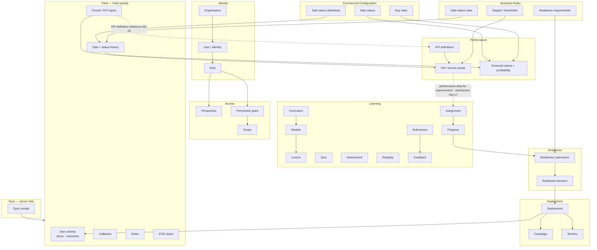
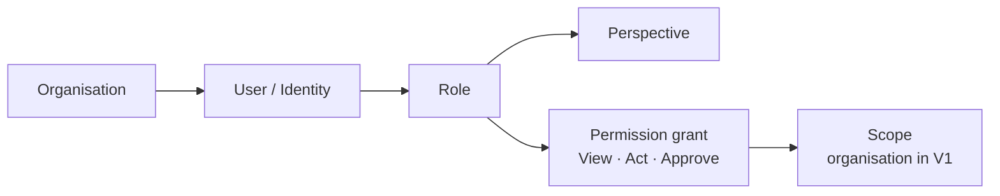
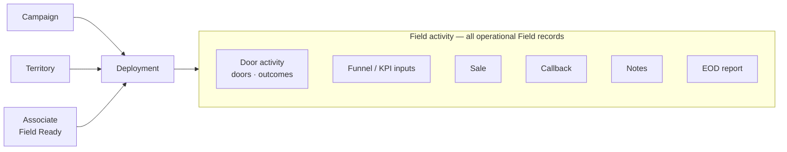
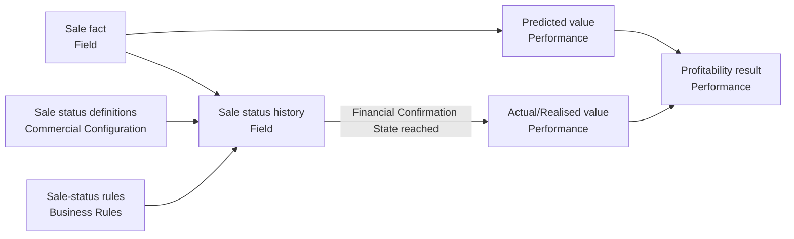
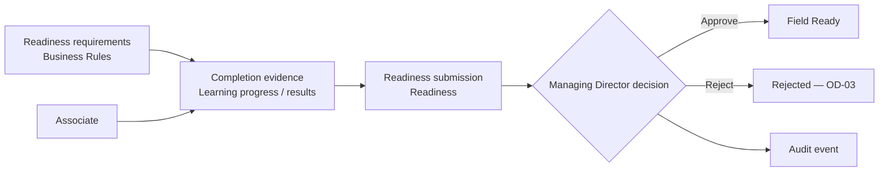
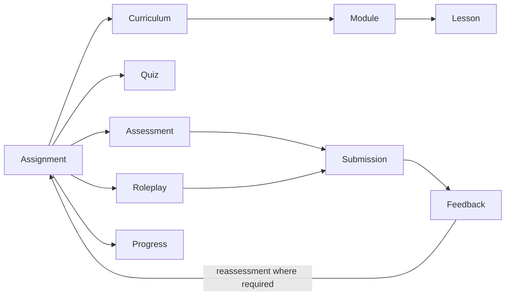
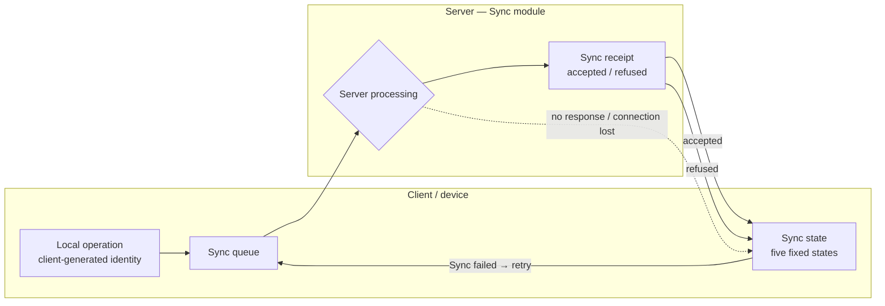
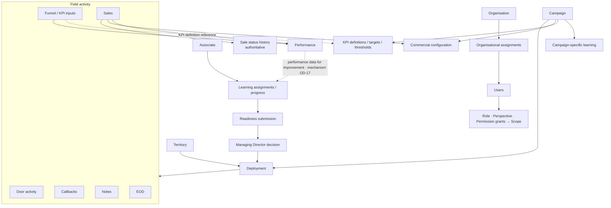

# IMPERIAL OS — V1 Domain Model

> **Related:** [00 — Product Overview](./00-product-overview.md) · [01 — V1 Scope](./01-v1-scope.md) · [02 — User Journeys](./02-user-journeys.md) · [03 — Architecture](./03-architecture.md)
>
> This is the **conceptual** domain model for V1. It defines business concepts, their ownership and their relationships. It is **not** a database schema: it contains no tables, column types, indexes, SQL or Prisma syntax. The physical schema belongs in `docs/06-database.md`.
>
> It introduces **no new business requirements**. Unresolved behaviour is referenced by `OD-xx` from [01 — V1 Scope, Section 16](./01-v1-scope.md#16-open-business-decisions). Architectural decisions (`AD-xx`) and open technical items (`AQ-xx`) are from [03 — Architecture](./03-architecture.md#19-architectural-decisions-and-open-decisions).

---

## Contents

1. [Purpose and Modelling Principles](#1-purpose-and-modelling-principles)
2. [Domain Map](#2-domain-map)
3. [Core Entities](#3-core-entities)
4. [Identity and Organisational Model](#4-identity-and-organisational-model)
5. [Field Execution Model](#5-field-execution-model)
6. [Deployment Model](#6-deployment-model)
7. [Field Activity and Funnel Model](#7-field-activity-and-funnel-model)
8. [Sales Domain](#8-sales-domain)
9. [Commercial Configuration](#9-commercial-configuration)
10. [Performance Model](#10-performance-model)
11. [Readiness Model](#11-readiness-model)
12. [Learning and Roleplay Model](#12-learning-and-roleplay-model)
13. [Business Rules Model](#13-business-rules-model)
14. [Offline Synchronization Domain Concepts](#14-offline-synchronization-domain-concepts)
15. [Audit and History Concepts](#15-audit-and-history-concepts)
16. [Entity Relationship Summary](#16-entity-relationship-summary)
17. [Lifecycle / State Concepts](#17-lifecycle--state-concepts)
18. [V1 versus Future Domain Concepts](#18-v1-versus-future-domain-concepts)
19. [Domain Invariants](#19-domain-invariants)
20. [Open Domain Questions](#20-open-domain-questions)
21. [Domain Model Summary](#21-domain-model-summary)

---

## 1. Purpose and Modelling Principles

### Why This Model Exists

The product documents describe **what** V1 must do; the architecture describes **how the system is shaped**. Before designing the physical PostgreSQL schema, the business concepts, their owners and their relationships must be agreed so that the schema reflects the operating model rather than screen layouts or convenience.

### Principles

| Principle                              | Meaning                                                                                                                   |
| -------------------------------------- | ------------------------------------------------------------------------------------------------------------------------- |
| Conceptual before physical             | This model names concepts and relationships. The physical schema (`06-database.md`) decides how they are stored.        |
| One source of truth per business fact  | Every business fact has exactly one owning domain. Other domains reference it; they do not keep their own copy.         |
| Relationships follow the operating model | Relationships are those the documented operating loop requires: readiness → deployment → field → performance → learning. |
| Facts versus derived values            | Recorded facts (a sale, a door outcome) are distinct from derived values (KPI results, profitability), which are recomputable. |
| Configuration versus operational records | Admin-managed configuration (campaigns, KPI definitions, day rates) is distinct from records created during operation (field activity, submissions). |
| Room for the future, not the future    | Future roles and scopes must fit without redesign, but are not modelled in detail.                                       |
| Unresolved stays unresolved            | Where behaviour is undecided, the concept is named and linked to its `OD-xx`. No behaviour is invented.                  |

### Domain Facts versus Technical Details

| Domain fact (modelled here)                                  | Technical detail (not modelled here)                     |
| ------------------------------------------------------------ | -------------------------------------------------------- |
| A sale was recorded by an Associate on customer sign-up       | Table layout, column types, keys                         |
| A sale moved from one configured status to another           | How the status history is stored                         |
| A day rate applies from an effective date                    | How versions are indexed or queried                      |
| A Field record was accepted by the server                    | Transport, batch format, endpoint shape                  |
| Each Field record has a client-generated identity (`AD-19`)  | Identifier format and generation library                 |

---

## 2. Domain Map

Domains below follow the backend modules in [03 — Architecture, Section 5](./03-architecture.md#5-backend-module-boundaries).

| Requested concept           | Owning domain (module)       | Notes                                                                            |
| --------------------------- | ---------------------------- | -------------------------------------------------------------------------------- |
| Organisation                | Identity                     | V1 scope boundary (`AD-15`).                                                     |
| Identity / User             | Identity                     | One identity per user.                                                           |
| Role                        | Identity                     | Junior Associate, Associate, Managing Director.                                  |
| Perspective                 | Access                       |                                                                                  |
| Scope                       | Access                       | Organisation-level in V1.                                                        |
| Campaign                    | Deployment                   | `AD-06`.                                                                         |
| Territory                   | Deployment                   | `AD-06`.                                                                         |
| Deployment                  | Deployment                   | `AD-06`; lifecycle `OD-11`.                                                      |
| Readiness                   | Readiness                    | Requirements themselves: Business Rules.                                        |
| Learning                    | Learning                     |                                                                                  |
| Curriculum / Module / Lesson | Learning                    |                                                                                  |
| Quiz / Assessment / Roleplay / Submission / Feedback | Learning      | `AD-09`. Distinct concepts (Section 3.4).                                        |
| Funnel / KPI                | Field (inputs), Performance (definitions, calculations), Business Rules (targets, thresholds) | `AD-08`. Field inputs hold a KPI definition reference only (`AD-23`). |
| Field                       | Field                        |                                                                                  |
| Sale                        | Field                        | `AD-07`.                                                                         |
| Sale Status                 | Commercial Configuration (definitions), Business Rules (allowed transitions), Field (a sale's status history) | `AD-07`. |
| Commercial Configuration    | Commercial Configuration     | Effective-dated (`AD-20`).                                                       |
| Performance                 | Performance                  | KPI, funnel and profitability calculations.                                     |
| Business Rules              | Business Rules               | Typed V1 rules, not a generic engine (`AD-12`).                                 |
| Offline Sync                | Mobile client (device-side sync state); Sync (server-side receipts) | Sync owns delivery, not business data (`AD-13`). See Section 14. |
| Audit                       | Audit                        | Append-only (`AD-22`).                                                           |

---

## 3. Core Entities

Attributes below are **concepts**, not columns.

### 3.1 Identity

| Entity | Purpose | Owner | Important concepts | Relationships | Lifecycle / state | ODs |
| ------ | ------- | ----- | ------------------ | ------------- | ----------------- | --- |
| **Organisation** | The organisation operating IMPERIAL OS; the V1 scope boundary. | Identity | Name; organisation is the V1 scope. | Has Users (through Organisational assignments), Campaigns, Territories, configuration. | — | — |
| **User / Identity** | One person using IMPERIAL OS. One identity regardless of role. | Identity | Identity, profile, authentication link (`AQ-01`). | Linked to the Organisation through its Organisational assignment; holds a Role; receives Perspectives and Permission grants through its Role (`AD-24`). | Account existence and first access: `OD-04`. | `OD-04` |
| **Role assignment** | The user's organisational role. | Identity | Junior Associate, Associate or Managing Director. | User → Role. | Role change (Junior Associate → Associate): `OD-26`. | `OD-26` |
| **Organisational assignment** | The single representation of a user's membership of the organisation ("organisational assignments", 01 §4). | Identity | Assignment to the organisation (V1). | User → Organisational assignment → Organisation. | — | — |
| **Onboarding state** | The Associate's onboarding position (induction, documentation). | Identity (`OD-05`) | Onboarding progress. | User → Onboarding state. | Contents and relation to Field Readiness: `OD-05`. | `OD-05` |

### 3.2 Access

| Entity | Purpose | Owner | Important concepts | Relationships | Lifecycle / state | ODs |
| ------ | ------- | ----- | ------------------ | ------------- | ----------------- | --- |
| **Perspective** | How the user is operating/viewing the system. | Access | Associate perspective (mobile), Managing Director perspective (web / Admin). | Role → Perspective(s); a user has the perspectives of their role (`AD-24`). | — | — |
| **Scope** | The organisational/data boundary the user may operate within. | Access | Scope type (organisation in V1) and the bounded entity (`AD-15`). | Permission grant → Scope. | — | — |
| **Permission grant** | What a role may do within a scope. | Access | View, Act, Approve. | Role → Permission grant → Scope; a user's effective permissions come from their role assignment(s) (`AD-24`). No per-user grants in V1. | — | Unauthorized response: `OD-27` |

### 3.3 Deployment

| Entity | Purpose | Owner | Important concepts | Relationships | Lifecycle / state | ODs |
| ------ | ------- | ----- | ------------------ | ------------- | ----------------- | --- |
| **Campaign** | A campaign the organisation runs; carries campaign-specific differences. | Deployment | Identity of the campaign; associated client (see `OD-30`). | Has commercial configuration, KPI definitions/targets, campaign-specific learning; used by Deployments. | — | `OD-30` |
| **Territory** | The area worked during Field execution. | Deployment | Identity of the territory. No mapping/intelligence in V1. | Used by Deployments. Relation to Campaign: `OD-11`. | — | `OD-11` |
| **Deployment** | Assignment of a Field Ready Associate to a Campaign and Territory. | Deployment | Associate, Campaign, Territory. | Associate → Deployment → Campaign, Territory. Field activity is recorded within a Deployment. | "Active" is established; everything else: `OD-11`. | `OD-11` |

### 3.4 Learning

| Entity | Purpose | Owner | Important concepts | Relationships | Lifecycle / state | ODs |
| ------ | ------- | ----- | ------------------ | ------------- | ----------------- | --- |
| **Curriculum** | A structured programme of learning. | Learning | Campaign-specific where applicable (Campaign reference, `AD-23`). | Contains Modules; may be associated with a Campaign; may be referenced by readiness requirements. The Curriculum itself does not determine what counts toward readiness — readiness requirements (Business Rules) do. | — | — |
| **Module** | A unit within a Curriculum. | Learning | Ordering within curriculum. | Curriculum → Module → Lessons. | — | — |
| **Lesson** | A single learning item. | Learning | Written/video content (media storage `AQ-02`). | Module → Lesson. | — | — |
| **Quiz** | A quiz on learning content (listed separately from assessments in 01 §11). | Learning | Definition; Associate attempts and results. | Linked to learning items; may be referenced by a readiness requirement. | Scoring, pass, retake: `OD-07`. | `OD-07` |
| **Assessment** | An assessment of the Associate (listed separately from quizzes in 01 §11). | Learning | Definition. | Linked to learning items; may be referenced by a readiness requirement; completed by a Submission. | Scoring, pass, retake: `OD-07`. | `OD-07` |
| **Roleplay** | A practised sales interaction. | Learning | Definition. | Linked to learning items; may be referenced by a readiness requirement; completed by a Submission. | Format, submission, feedback provider: `OD-08`. | `OD-08` |
| **Assignment** | Learning given to an Associate. | Learning | Associate, learning item, reason (readiness, campaign, improvement). | Associate → Assignment → learning item. | Improvement assignment source: `OD-17`. | `OD-17` |
| **Progress** | How far an Associate has progressed on an assignment. | Learning | Progress against the assignment. | Assignment → Progress. | States and completion: `OD-09`. | `OD-09` |
| **Submission** | An Associate's submitted assessment or roleplay ("roleplay/assessment submitted", 01 §11). | Learning | Associate, the assessment or roleplay, time. | Assessment / Roleplay → Submission. | V1 learning loop (Section 12). | `OD-07`, `OD-08` |
| **Feedback** | Feedback on a Submission. | Learning | Feedback; whether reassessment is required. | Submission → Feedback. | Reassessment where required (01 §11). Who provides roleplay feedback: `OD-08`. | `OD-07`, `OD-08` |

### 3.5 Readiness

| Entity | Purpose | Owner | Important concepts | Relationships | Lifecycle / state | ODs |
| ------ | ------- | ----- | ------------------ | ------------- | ----------------- | --- |
| **Readiness requirement** | Something an Associate must satisfy to become Field Ready. | Business Rules | Requirement and what evidences it. | References learning items; evaluated by Readiness. | Types and completion criteria: `OD-06`. | `OD-06` |
| **Readiness submission** | The Associate's request for approval. | Readiness | Associate, time, requirement status at submission. | Associate → Submission → Decision. | Submission preconditions: `OD-06`. | `OD-06` |
| **Readiness decision** | The Managing Director's approve/reject decision. | Readiness | Decision, actor, time. Auditable. | Submission → Decision; written to Audit. | Rejection next state: `OD-03`. | `OD-03` |
| **Readiness state** | The Associate's current readiness position. | Readiness | Derived from submissions and decisions. | Associate → Readiness state; gates Deployment eligibility. | Section 17.1. | `OD-03`, `OD-28` |

### 3.6 Field

| Entity | Purpose | Owner | Important concepts | Relationships | Lifecycle / state | ODs |
| ------ | ------- | ----- | ------------------ | ------------- | ----------------- | --- |
| **Door activity** | A door worked during Field execution, its outcome and related door-level activity. One kind of Field activity. | Field | Door, outcome, time, client-generated identity (`AD-19`). | Deployment → Door activity. | Device-side sync state until accepted (Section 14). Outcome set: `OD-12`. Editing: `OD-21`. | `OD-12`, `OD-21`, `OD-31` |
| **Funnel activity** | Activity against the five standard funnel stages. | Field | Stage, count/occurrence. | Deployment → Funnel activity; consumed by Performance. | Granularity: `OD-13`. | `OD-13`, `OD-31` |
| **KPI input** | A KPI value recorded in Field. | Field | Reference to the KPI definition it was recorded against (identifier only, `AD-23`), value. | Deployment → KPI input; KPI input references a KPI definition (Performance). | Device-side sync state until accepted (Section 14). | `OD-23` |
| **Sale** | A sale recorded on customer agreement/sign-up. | Field | Associate, Deployment/Campaign, time, current status (derived from the latest accepted Sale status history entry). | Deployment → Sale → Sale status history; consumed by Performance. | Section 8. Required fields: `OD-14`. | `OD-14`, `OD-15`, `OD-31` |
| **Sale status history entry** | One accepted change of a sale's status. **The authoritative record of a sale's status.** | Field | From/to status, actor (Managing Director), time. | Sale → entries → Sale status definition. | Allowed transitions: `OD-15`. | `OD-15` |
| **Callback** | A callback recorded in Field. | Field | Callback details. | Deployment → Callback. | Triggering, due-date, escalation, overdue: `OD-01`. | `OD-01` |
| **Note** | A note recorded in Field. Supported offline. | Field | Note text. | Deployment / Field record → Note. | Device-side sync state until accepted (Section 14). | — |
| **EOD report** | End-of-day reporting. Draft can be created offline. | Field | Draft; final server-side processing after sync. | Associate / Deployment → EOD report. | Deadlines: `OD-02`. Content and processing: `OD-22`. | `OD-02`, `OD-22` |

### 3.7 Commercial Configuration

| Entity | Purpose | Owner | Important concepts | Relationships | Lifecycle / state | ODs |
| ------ | ------- | ----- | ------------------ | ------------- | ----------------- | --- |
| **Sale value** | The value of a sale for a campaign/client. | Commercial Configuration | Campaign/client, value, effective date. | Campaign → Sale value. | Effective-dated versions (`AD-20`). | — |
| **Sale status definition** | A configured sale status. | Commercial Configuration | Status name, order where applicable. | Referenced by Sale status history. | — | `OD-15` |
| **Financial Confirmation State** | The configured sale status at which the financial value becomes Actual/Realised (also called "actual/realised status" in 01 §10). | Commercial Configuration | Designated sale status. | Sale status definition. | — | — |
| **Expected processing/payment timeframe** | How long processing/payment is expected to take. | Commercial Configuration | Timeframe. | Commercial configuration (granularity not specified). | Use in calculation: `OD-16`. | `OD-16` |
| **Associate day rate** | The day rate applied for an Associate. | Commercial Configuration | Rate, effective date. | Associate / role / campaign (granularity: `OD-29`). | Effective-dated versions. | `OD-16`, `OD-29` |

### 3.8 Performance

| Entity | Purpose | Owner | Important concepts | Relationships | Lifecycle / state | ODs |
| ------ | ------- | ----- | ------------------ | ------------- | ----------------- | --- |
| **KPI definition** | Defines a KPI, including campaign-specific definitions. | Performance | KPI, campaign association. | Campaign → KPI definition; referenced by KPI inputs (`AD-23`). | — | — |
| **Performance measurement** | Calculated KPI and funnel results and history. | Performance | Derived; recomputable. | From Field inputs + KPI definitions + targets/thresholds. | — | `OD-13` |
| **Financial value** | Predicted or Actual/Realised value of a sale. | Performance | Kind (predicted / actual/realised), configuration version used (`AD-21`). | Sale → Financial value → Commercial configuration version. | Predicted on acceptance; Actual/Realised on reaching the Financial Confirmation State. | `OD-15` |
| **Profitability result** | Predicted or Actual/Realised profitability. | Performance | Derived from financial values and day rates. | Financial values + day rates → Profitability. | Formula and period: `OD-16`. | `OD-16` |
| **Performance data for improvement** | Performance data can be used for improvement. This is not a mechanism. | Performance | Existing performance measurements, targets and thresholds. | May inform improvement work in Learning. | Whether improvement work is assigned by the Managing Director, generated by the system, or both: `OD-17`. | `OD-17` |

### 3.9 Business Rules

| Entity | Purpose | Owner | Important concepts | Relationships | Lifecycle / state | ODs |
| ------ | ------- | ----- | ------------------ | ------------- | ----------------- | --- |
| **Target** | KPI target. | Business Rules | KPI, value, applicability (campaign; role/status per 01 §5; meaning of status: `OD-32`). | KPI definition → Target. | — | `OD-32` |
| **Threshold** | KPI threshold or operating threshold. | Business Rules | Threshold value, applicability. | KPI definition / operation → Threshold. | — | `OD-17`, `OD-18` |
| **Sale-status rule** | Allowed sale status transitions. | Business Rules | From/to statuses. | Sale status definitions. | `OD-15`. | `OD-15` |
| **Callback rule** | Callback behaviour. | Business Rules | Category established; content undecided. | Callbacks. | `OD-01`. | `OD-01` |
| **EOD deadline rule** | EOD deadline behaviour. | Business Rules | Category established; content undecided. | EOD reports. | `OD-02`. | `OD-02` |
| **Approval rule** | Approval rule category (01 §12). In V1 the approver is fixed: the Managing Director approves Field Readiness. The approver is not configurable. | Business Rules | Approval rule category. | Readiness decisions. | Rejection flow: `OD-03`. | `OD-03` (rejection flow only) |

### 3.10 Sync and Audit

| Entity | Purpose | Owner | Important concepts | Relationships | Lifecycle / state | ODs |
| ------ | ------- | ----- | ------------------ | ------------- | ----------------- | --- |
| **Local operation** | One operation on the device delivering a Field record. Client/device-side. | Mobile client (not a backend module) | Client-generated identity, creation order. | Local operation → Field record. | The five fixed client/device sync states (Section 14). | `OD-19`, `OD-21` |
| **Sync receipt** | The server's record that an operation identity was received and processed, and its outcome. Server-side. | Sync | Operation identity, outcome, time. | Receipt → operation identity → resulting Field record. | Server outcome: accepted or refused. This is not one of the five client sync states. | `OD-19` |
| **Audit event** | Append-only record of an auditable action. | Audit | Actor, action, subject, time. | Any audited domain event. | — | `OD-24` |

---

## 4. Identity and Organisational Model

| Distinction                          | Meaning                                                                                                     |
| ------------------------------------ | ----------------------------------------------------------------------------------------------------------- |
| Role ≠ Permission                    | A Role is an organisational position. Permissions are granted within a scope; they are not inferred from a role name in clients. |
| Perspective ≠ Scope                  | Perspective is *how* the user is operating/viewing the system. Scope is *which* organisational/data boundary they may operate within. |
| Permission does not replace them     | Permission grants are stored as their own concept. They are not a substitute for storing Role, Perspective or Scope. |
| Role-based attachment (`AD-24`)      | In V1, perspectives and permission grants are attached to roles, and users receive effective access through their role assignments. This fixes only what they are attached to; the four concepts stay distinct. No per-user customisation in V1. |

V1 facts:

- **Roles:** Junior Associate, Associate, Managing Director. There is **no** `ADMIN` role; Admin is the web experience.
- **Junior Associate vs Associate:** not unnecessarily different technical permissions. Differences come from status, curriculum, expectations, targets, commercial configuration and progression. Meaning of status: `OD-32`. Progression mechanics: `OD-26`.
- **Managing Director:** company-wide authorised visibility and management; uses the Admin web experience; approves Field Readiness; updates sale status.
- **Scope:** organisation-level in V1. Scope type is a concept in its own right so region, area, campaign or territory scopes can be added later (`AD-15`). Associates operate on their own records (`AD-16`).
- **Future roles** (Senior Associate, Area Sales Manager, Regional Sales Manager) are additional Role values with their own perspectives and scoped grants. They are not modelled now.

Unresolved: account creation and first access (`OD-04`), onboarding contents (`OD-05`), unauthorized-action response (`OD-27`).

---

## 5. Field Execution Model

| Term              | Meaning                                                                                                       |
| ----------------- | ------------------------------------------------------------------------------------------------------------- |
| **Field activity** | The broader set of operational Field records: door activity, funnel/KPI inputs, sales, callbacks, notes and EOD. |
| **Door activity**  | Doors, outcomes and related door-level activity. One kind of Field activity.                                  |

| Concept                    | Kind                   | Owner                    |
| -------------------------- | ---------------------- | ------------------------ |
| Campaign                   | Configuration          | Deployment (`AD-06`)     |
| Territory                  | Configuration          | Deployment (`AD-06`)     |
| Deployment                 | Operational assignment (created by Managing Director) | Deployment |
| Associate                  | Identity               | Identity                 |
| Door activity / outcomes   | Operational record     | Field                    |
| Funnel / KPI inputs        | Operational record     | Field (holds KPI definition reference, `AD-23`) |
| KPI definitions            | Configuration          | Performance              |
| Sale and status history    | Operational record     | Field (`AD-07`)          |
| Callback                   | Operational record     | Field                    |
| Note                       | Operational record     | Field                    |
| EOD report (draft / final) | Operational record     | Field                    |
| Callback and EOD rules     | Configuration          | Business Rules (`OD-01`, `OD-02`) |

Field is the source of truth for field activity. Whether Field execution requires completed campaign preparation is `OD-10`. Callback and EOD behaviour remains `OD-01`, `OD-02` and `OD-22`.

---

## 6. Deployment Model

### What Is Established

| Fact                                                                                       | Source                    |
| ------------------------------------------------------------------------------------------ | ------------------------- |
| A Deployment is managed by the Managing Director.                                          | 01 §4                     |
| A Field Ready Associate receives a Campaign and Territory.                                 | 01 §2 steps 6–7           |
| The Associate has an **active** Campaign and an **active** Territory.                      | 01 §3                     |
| Field execution shows recently loaded deployment information, including offline.           | 01 §7, §8                 |
| Campaigns, Territories and Deployments belong to one Deployment module.                    | `AD-06`                   |

### What Remains Undefined (`OD-11`)

- The exact relationship of Deployment to Campaign and Territory (e.g. whether a Territory belongs to a Campaign).
- Deployment states beyond "active".
- How a Deployment starts and ends.
- Whether an Associate can have more than one active Deployment.

Also undefined: the effect of configuration changes on an active Deployment (`OD-28`), and what "recently loaded" means offline (`OD-20`).

---

## 7. Field Activity and Funnel Model

### Standard Funnel

| Order | Stage                  |
| ----- | ---------------------- |
| 1     | Attention & Engagement |
| 2     | Problem Awareness      |
| 3     | Consequence Evaluation |
| 4     | Solution Alignment     |
| 5     | Close / Agreement      |

| Concept                         | Owner          | Notes                                                                       |
| ------------------------------- | -------------- | --------------------------------------------------------------------------- |
| Funnel structure (five stages)  | Fixed / standardized | Not configurable per campaign.                                        |
| Funnel / KPI inputs             | Field          | Operational inputs recorded by the Associate. Each holds a KPI definition reference only (`AD-23`). |
| KPI definitions                 | Performance    | Campaign-specific definitions are configurable around the funnel structure. |
| Targets and thresholds          | Business Rules | Campaign-specific values are configurable.                                 |
| Funnel performance, KPI results | Performance    | Calculated from Field inputs; never re-entered.                            |

Invariant: **a later funnel-stage count must not exceed an earlier-stage count.**

Unresolved: whether funnel data is recorded per door or as aggregate totals, and where funnel validity is enforced (`OD-13`); door outcome set (`OD-12`).

---

## 8. Sales Domain

Following `AD-07`:

| Concept                  | Owner                    | Description                                                                                       |
| ------------------------ | ------------------------ | ------------------------------------------------------------------------------------------------- |
| **Sale fact**            | Field                    | The Associate obtained customer agreement/sign-up. Recorded by the Associate.                    |
| **Sale status**          | Field (status history and current status); Commercial Configuration (status definitions) | The sale's position in the configured statuses. Updated by the Managing Director. |
| **Allowed transitions**  | Business Rules           | Which status changes are allowed (`OD-15`).                                                       |
| **Predicted value**      | Performance              | Calculated when the server accepts the sale, from the applicable commercial configuration.        |
| **Actual/realised value**| Performance              | Calculated when the sale reaches the configured Financial Confirmation State.                    |

### Sale Status Source of Truth

| Concept              | Role                                                                                                   |
| -------------------- | ------------------------------------------------------------------------------------------------------ |
| Sale status history  | **Authoritative.** The record of every accepted status transition.                                    |
| Current status       | **Derived.** The status of the latest accepted history entry. It is a representation, not a second source of truth. |

Which transitions are accepted is governed by sale-status rules (`OD-15`); this section does not change them.
| **Profitability result** | Performance              | Predicted and actual/realised profitability (formula and period: `OD-16`).                        |

- The Managing Director changes **status**, never value or profit.
- IMPERIAL OS does not recreate client CRM/sales systems; required sale fields are `OD-14`.
- Reversals after Actual/Realised and non-realised end states: `OD-15`.

---

## 9. Commercial Configuration

| Concept                                | Established by | Notes                                                                        |
| -------------------------------------- | -------------- | ---------------------------------------------------------------------------- |
| Campaign/client sale value             | 01 §10         | Basis of predicted value.                                                    |
| Sale statuses                          | 01 §10         | Configurable by the Managing Director.                                       |
| Financial Confirmation State           | 01 §10 ("actual/realised status"); 00 §10, 01 §10 ("financial confirmation state") | The configured sale status at which value becomes Actual/Realised. Canonical term used in this document. |
| Expected processing/payment timeframe  | 01 §10         | Commercial configuration (granularity not specified). Its role in calculations: `OD-16`. |
| Associate day rate                     | 01 §10         | Granularity: `OD-29`.                                                        |
| Effective dates                        | 01 §10         | Required for day-rate changes; applied to all commercial configuration (`AD-20`). |
| Campaign-specific differences          | 01 §10         | Commercial configuration can differ per campaign.                           |

### Why Effective Dating Matters

Historical profitability must preserve the commercial configuration that applied at the relevant time. If a day rate or sale value changes, earlier sales and earlier periods must still be calculated with the earlier values. Therefore:

- A change creates a new effective-dated version; earlier versions remain.
- A financial value records which configuration version(s) it used (`AD-21`).

No example values are defined here. The profitability formula is `OD-16`.

---

## 10. Performance Model

| Concept                      | Owner          | Source of data                                                       |
| ---------------------------- | -------------- | -------------------------------------------------------------------- |
| KPI inputs                   | Field          | Recorded by the Associate.                                           |
| KPI definitions              | Performance    | Configured by the Managing Director.                                 |
| Targets                      | Business Rules | Configured; may differ by campaign and by Associate role/status (01 §5; meaning of status: `OD-32`). |
| Thresholds                   | Business Rules | Configured KPI and operating thresholds.                             |
| Performance measurements     | Performance    | KPI records, funnel performance, history, analysis — derived.        |
| Profitability inputs         | Field + Commercial Configuration | Sale facts and status; sale values; day rates.     |
| Predicted profitability      | Performance    | Derived from predicted values and day rates (`OD-16`).               |
| Actual/realised profitability | Performance   | Derived from actual/realised values and day rates (`OD-16`).         |
| Performance data for improvement | Performance | Performance data can be used for improvement. The mechanism — Managing Director assignment, system-generated improvement, or both — is `OD-17`. |

- Performance **calculates** from underlying facts and configuration. It never accepts manually typed profit.
- Performance **consumes** Field data; it does not duplicate Field input.
- Calculation period and formula are unresolved (`OD-16`).

---

## 11. Readiness Model

| Concept                  | Owner          | Notes                                                                       |
| ------------------------ | -------------- | --------------------------------------------------------------------------- |
| Readiness requirements   | Business Rules | Types and completion criteria: `OD-06`.                                     |
| Completion evidence      | Learning       | Readiness reads Learning progress/results; it does not copy them (`AD-10`).|
| Readiness submission     | Readiness      | Submission preconditions: `OD-06`.                                          |
| Readiness decision       | Readiness      | Made by the Managing Director only. **Auditable.**                         |
| Readiness state          | Readiness      | Determines eligibility for Deployment.                                      |

- The Managing Director is the only V1 approver; there is no delegation.
- The rejection flow — feedback, identification of gaps, correction, resubmission, re-approval — is unresolved (`OD-03`).
- Whether readiness can be lost after approval (e.g. configuration change) is unresolved (`OD-28`).

---

## 12. Learning and Roleplay Model

V1 learning loop: skill/learning assigned → work completed → roleplay/assessment submitted → feedback → improvement → reassessment where required → repeat.

| Concept                    | Description                                                                                 | ODs              |
| -------------------------- | ------------------------------------------------------------------------------------------- | ---------------- |
| Curriculum / Module / Lesson | Admin-managed learning structure with written/video content.                              | —                |
| Quiz                       | Admin-managed definitions; Associate attempts and results.                                  | `OD-07`          |
| Assessment                 | Admin-managed definitions; completed through a Submission.                                  | `OD-07`          |
| Roleplay                   | Admin-managed definitions; completed through a Submission.                                  | `OD-08`          |
| Submission                 | An Associate's submitted assessment or roleplay.                                            | `OD-07`, `OD-08` |
| Feedback                   | Feedback on a Submission; may require reassessment.                                         | `OD-08`          |
| Assignment                 | Learning given to an Associate for readiness, campaign preparation or improvement.          | `OD-17`          |
| Progress                   | Associate progress on an assignment.                                                        | `OD-09`          |
| Readiness-related learning | Learning referenced by readiness requirements. Readiness requirements (Business Rules) determine what counts toward readiness; Learning provides the content and the learning records used as evidence. | `OD-06` |
| Campaign-specific learning | Learning associated with a Campaign, where required (Campaign reference, `AD-23`).         | `OD-10`          |

Learning is data-driven and Admin-managed: structure and content are configuration records, not code. How assessments and roleplays are positioned within a curriculum (e.g. attached to a lesson or module) is not specified. No grading or progression rules are defined here.

---

## 13. Business Rules Model

Business Rules owns **organisational logic** expressed as typed, V1-specific configured rules (`AD-12`). The owning domain module applies them.

| Rule category (01 §12)     | Applied by     | ODs     |
| -------------------------- | -------------- | ------- |
| Readiness requirements     | Readiness      | `OD-06` |
| KPI targets                | Performance    | —       |
| KPI thresholds             | Performance    | `OD-17` |
| Callbacks                  | Field          | `OD-01` |
| EOD deadlines              | Field          | `OD-02` |
| Approvals                  | Readiness (approver fixed in V1: Managing Director) | `OD-03` (rejection flow only) |
| Operating thresholds       | Owning module  | `OD-18` |
| Commercial rules           | Not specified  | —       |
| Sale-status rules          | Field          | `OD-15` |

Boundaries (no duplicated ownership):

| Business Rules owns            | Not Business Rules                                                      |
| ------------------------------ | ----------------------------------------------------------------------- |
| Which sale status transitions are allowed | Which sale statuses exist and which is the Financial Confirmation State — Commercial Configuration |
| Commercial *rules*             | Commercial *values* (sale values, day rates, timeframes) — Commercial Configuration |
| Targets and thresholds         | KPI definitions and KPI calculations — Performance                      |
| Readiness requirements         | Readiness submissions, decisions and state — Readiness                  |

"Commercial rules" appears as a Business Rules category in 01 §12, but the source documents do not specify what it contains or which module applies it. It is listed here as not specified.

---

## 14. Offline Synchronization Domain Concepts

Offline sync has two sides. The **client/device** owns the sync state of each local operation. The **server** (Sync module) owns receipts recording what it received and processed. The server does **not** own or store "Saved locally" or "Pending sync"; those exist only on the device.

### Client / Device Side

| Concept              | Meaning                                                                                                    |
| -------------------- | ---------------------------------------------------------------------------------------------------------- |
| Local operation      | A Field record created on-device, with a client-generated identity (`AD-19`).                             |
| Sync queue           | Ordered on-device queue of operations awaiting acceptance.                                                |
| Sync state           | The operation's position in the five fixed client/device states below.                                    |
| Retry                | Failed operations are retried. Policy: `OD-19`.                                                            |
| Reconciliation       | The client aligns its local sync states with server receipts.                                             |

Fixed client/device sync states:

| State               | Submitted? |
| ------------------- | ---------- |
| Saved locally       | No         |
| Pending sync        | No         |
| Syncing             | No         |
| Successfully synced | Yes — only after server acceptance |
| Sync failed         | No         |

"Successfully synced" is set on the device only when the server has accepted the operation.

### Server Side

| Concept              | Meaning                                                                                                    |
| -------------------- | ---------------------------------------------------------------------------------------------------------- |
| Server acceptance    | The backend validated, authorized and persisted the operation. Only this counts as submitted.             |
| Sync receipt         | The server's record of an operation's identity and outcome (accepted or refused). Owned by Sync.         |
| Duplicate protection | Receiving the same operation identity again returns the existing receipt and does not create another record. |

Unresolved: refused-record handling and retry policy (`OD-19`), offline cache and session (`OD-20`), editing and therefore conflicts (`OD-21`), configuration changed while offline (`OD-28`).

---

## 15. Audit and History Concepts

| Concept                              | Required for the domain to work | Audit trail presentation / wider scope |
| ------------------------------------ | -------------------------------- | -------------------------------------- |
| Readiness approval / rejection       | **Yes** — approvals must be auditable | Approval history view: `OD-24`     |
| Sale status history                  | **Yes** — authoritative status record; Actual/Realised depends on reaching the Financial Confirmation State | Treated as audit trail: `OD-24` |
| Commercial configuration versions / effective dates | **Yes** — historical profitability depends on them | Treated as audit trail: `OD-24` |
| Sync receipts (server side)          | **Yes** — duplicate protection and reconciliation depend on them | —                       |
| Other business state transitions (learning, deployment, readiness state) | Time and actor recorded on the record | Further audit scope: `OD-24` |
| Other configuration changes          | Time and actor recorded on the record | Further audit scope: `OD-24`        |

No retention periods are defined.

---

## 16. Entity Relationship Summary

Relationships not established in the source documents are not drawn: the Territory–Campaign relationship (`OD-11`) and the Campaign–client relationship (`OD-30`).

---

## 17. Lifecycle / State Concepts

| Lifecycle       | Established                                                                                       | Unresolved                       |
| --------------- | ------------------------------------------------------------------------------------------------- | -------------------------------- |
| Readiness       | Requirements in progress → submitted → approved (Field Ready) or rejected. Names are descriptive. | After rejection `OD-03`; submission preconditions `OD-06`; loss of readiness `OD-28` |
| Sale            | Recorded (predicted value) → configured statuses → configured Financial Confirmation State (Actual/Realised). Status history is authoritative; current status is derived. | Status set is configured; transitions and reversals `OD-15` |
| Deployment      | Active Campaign and Territory.                                                                    | All other states `OD-11`         |
| Learning        | Assigned → progressing → complete (descriptive).                                                 | Exact states and completion `OD-09` |
| Roleplay / assessment | Assigned → submitted → feedback → reassessment where required.                              | Scoring/pass `OD-07`; format/feedback `OD-08` |
| Offline sync    | **Fixed client/device states:** Saved locally, Pending sync, Syncing, Successfully synced, Sync failed. Server side holds receipts (accepted / refused). | Retry/refusal `OD-19`            |

Only the offline sync states are fixed names. All other names in this table are descriptive.

---

## 18. V1 versus Future Domain Concepts

### V1 Concepts (Must Exist)

Organisation · Organisational assignment · User / Identity · Role (Junior Associate, Associate, Managing Director) · Perspective · Scope (organisation) · Permission grant (View / Act / Approve) · Onboarding state · Campaign · Territory · Deployment · Curriculum · Module · Lesson · Quiz · Assessment · Roleplay · Submission · Feedback · Assignment · Progress · Readiness requirement · Readiness submission · Readiness decision · Door activity · Funnel activity · KPI input · Sale · Sale status history · Callback · Note · EOD report · Sale value · Sale status definition · Financial Confirmation State · Processing/payment timeframe · Day rate · KPI definition · Target · Threshold · Business rules · Performance measurement · Financial value · Profitability result · Local operation (device) · Sync receipt (server) · Audit event.

Performance data can be used for improvement; the improvement mechanism itself is `OD-17` and is not modelled as an entity.

### Future Concepts (Leave Room, Do Not Implement)

| Future concept                               | How the V1 model leaves room                                        |
| -------------------------------------------- | ------------------------------------------------------------------- |
| Senior Associate, Area Sales Manager, Regional Sales Manager | Additional Role values with their own perspectives and grants. |
| Region / area / campaign / territory scopes  | Scope type is a concept, not fixed to organisation (`AD-15`).       |
| Advanced leadership / growth loops           | Not modelled.                                                       |
| Advanced recognition / progression system    | Not modelled; V1 role progression is `OD-26`.                       |
| Advanced territory intelligence, route optimization, interactive mapping | Territory remains a simple concept.         |
| AI coaching, AI-generated learning/reports   | Not modelled.                                                       |
| External integrations                        | Not modelled.                                                       |

---

## 19. Domain Invariants

Only invariants established in the source documents:

1. A later funnel-stage count must not exceed an earlier-stage count.
2. Profit is never manually typed; the Managing Director updates sale status and the system calculates.
3. Historical calculations use the commercial configuration (including day rates) that applied at the relevant time.
4. Field Readiness approvals are auditable.
5. Only the Managing Director approves Field Readiness and updates sale status in V1.
6. A Field record is not shown as submitted until the server has accepted it.
7. Repeated delivery of the same Field record does not create a duplicate.
8. Each business fact has one owning domain and one source of truth.
9. One identity per user; no separate identities per role.
10. There is no `ADMIN` organisational role.
11. Actual/Realised financial value arises only when the configured Financial Confirmation State is reached.

---

## 20. Open Domain Questions

### Business Decisions Affecting the Domain Model

Full wording: [01 — V1 Scope, Section 16](./01-v1-scope.md#16-open-business-decisions).

| Question                                                     | OD      |
| ------------------------------------------------------------ | ------- |
| Callback rule behaviour                                      | `OD-01` |
| EOD deadline rule behaviour                                  | `OD-02` |
| Readiness state after rejection                              | `OD-03` |
| Account creation and first access                            | `OD-04` |
| Onboarding contents and relation to readiness                | `OD-05` |
| Readiness requirement types and completion criteria          | `OD-06` |
| Assessment scoring, pass criteria, retakes                   | `OD-07` |
| Roleplay format, submission, feedback provider               | `OD-08` |
| Learning progress states                                     | `OD-09` |
| Whether preparation gates Field execution                    | `OD-10` |
| Deployment relationships, states, multiplicity               | `OD-11` |
| Door outcome set                                             | `OD-12` |
| Funnel recording granularity and validation location         | `OD-13` |
| Required sale fields                                         | `OD-14` |
| Sale status transitions and reversals                        | `OD-15` |
| Profitability formula, period, timeframe use                 | `OD-16` |
| Improvement identification and assignment                    | `OD-17` |
| Notifications / escalation                                   | `OD-18` |
| Sync retry and refused records                               | `OD-19` |
| Offline cache freshness and session                          | `OD-20` |
| Editing Field records                                        | `OD-21` |
| EOD content and processing                                   | `OD-22` |
| Required data per record type                                | `OD-23` |
| Audit scope and presentation                                 | `OD-24` |
| Home / overview contents                                     | `OD-25` |
| Junior Associate → Associate progression                     | `OD-26` |
| Unauthorized-action response                                 | `OD-27` |
| Configuration changes in flight                              | `OD-28` |
| Level at which an Associate day rate is set                  | `OD-29` |
| Whether Client is a separate V1 entity from Campaign         | `OD-30` |
| Whether Close / Agreement, a door outcome and a Sale can be the same customer event | `OD-31` |
| What Junior Associate vs Associate "status" means            | `OD-32` |

`OD-29` and `OD-30` were identified during domain modelling, and `OD-31` and `OD-32` during the domain model consistency review. All four are maintained in the central list with the other decisions and are not answered here.

- `OD-31` relates to `OD-12`, `OD-13` and `OD-14`.
- `OD-32` concerns the "status" in 01 §5, as distinct from Role, and relates to `OD-26`.

### Architectural Items to Resolve Later

These are technical, not business requirements: `AQ-01` authentication provider (depends on `OD-04`), `AQ-02` learning media storage, `AQ-03` backend/web hosting, `AQ-04` PROD database hosting.

---

## 21. Domain Model Summary

- **Core entities:** Organisation, Organisational assignments and Users (with Role, Perspective, Scope, Permission grants); Campaigns, Territories and Deployments; Curricula, Modules, Lessons, Quizzes, Assessments, Roleplays, Submissions, Feedback, Assignments and Progress; Readiness requirements, submissions and decisions; Field activity (door activity, funnel/KPI inputs, sales with authoritative status history, callbacks, notes, EOD); commercial configuration (sale values, sale statuses, the Financial Confirmation State, day rates, timeframes); KPI definitions, targets and thresholds; performance and profitability results; device-side local operations and server-side sync receipts; audit events.
- **Ownership:** Identity owns identity; Access owns perspectives, scopes and grants; Deployment owns campaigns, territories and deployments; Learning owns learning records; Readiness owns submissions, decisions and readiness state; Field owns field activity including sales; Commercial Configuration owns effective-dated commercial values; Performance owns KPI definitions and all calculations; Business Rules owns organisational rules; Sync owns delivery; Audit owns audit events. Admin configures but owns nothing separately.
- **Associate movement:** an Associate completes learning against readiness requirements, submits readiness, is approved by the Managing Director, is deployed to a Campaign and Territory, prepares, executes Field work, sees Performance and profitability, receives improvement work and repeats.
- **Managing Director interaction:** configures learning, readiness, campaigns, territories, deployments, commercial configuration, KPIs and rules; approves or rejects readiness (auditable); updates sale status, which drives Actual/Realised value.
- **Field to Performance:** Field records operational inputs; once accepted by the server, Performance calculates KPI and funnel results, predicted value and profitability from those facts and the applicable configuration. Field notifies Performance through an in-process event after committing; it does not call Performance (`AD-25`).
- **Learning and Readiness in the loop:** Learning provides the evidence Readiness requires before deployment, and the improvement work that follows Performance (`OD-17`), closing the loop.
- **Offline sync:** applies to Field records only. Records carry client-generated identities and wait in a local queue. The device owns the five sync states; the server owns receipts. A record counts as submitted — and shows "Successfully synced" — only once the server accepts it and issues a receipt.
